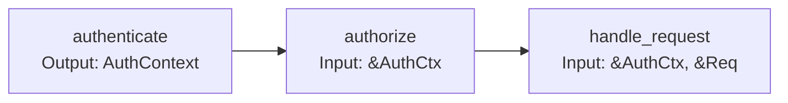
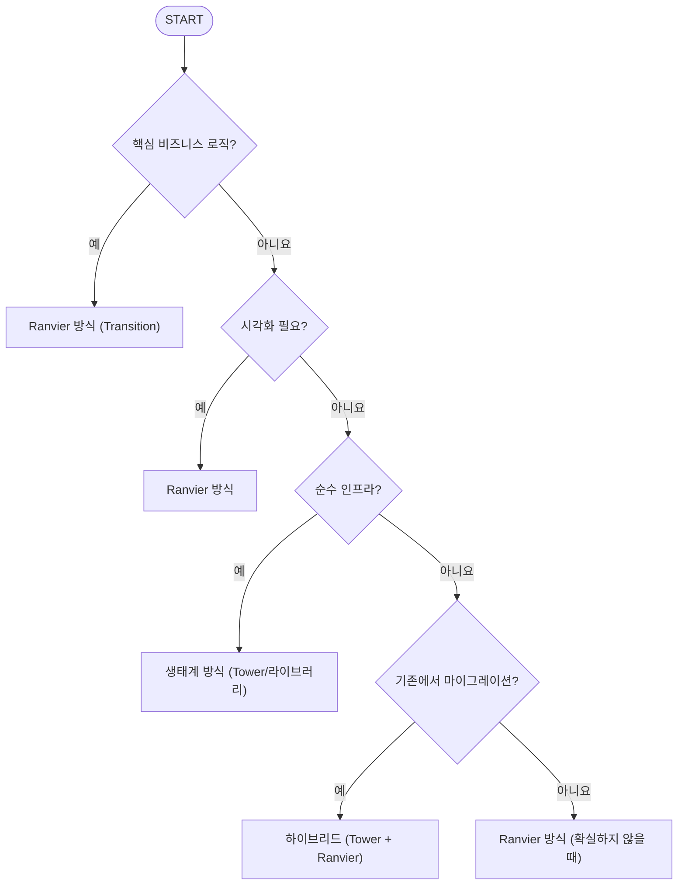
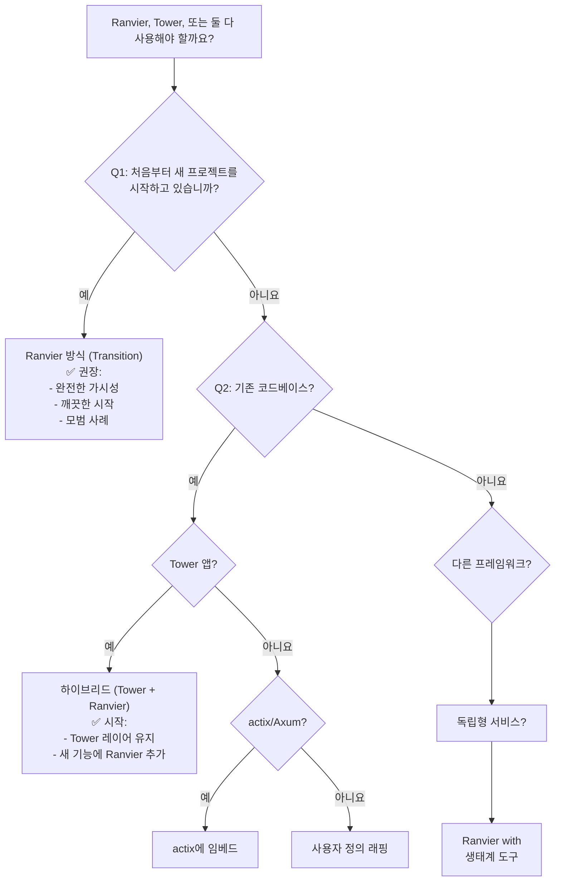
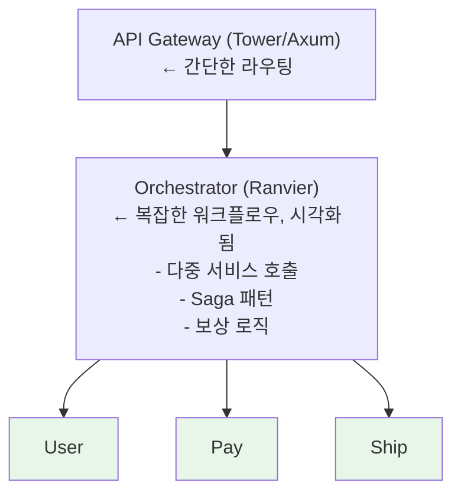

# Ranvier 철학: 의견이 분명한 핵심, 유연한 경계

**버전:** 0.43.0
**최종 업데이트:** 2026-04-03

---

## 소개

Ranvier는 이벤트 기반 시스템 구축을 위한 Rust 프레임워크로, 명확한 설계 철학을 가지고 있습니다: **의견이 분명한 핵심, 유연한 경계(Opinionated Core, Flexible Edges)**. 이 문서는 이것이 무엇을 의미하는지, 왜 중요한지, 그리고 Ranvier로 개발할 때 이 철학을 어떻게 적용하는지 설명합니다.

**TL;DR**: Ranvier는 내부 아키텍처에 대해 특정 패러다임(Transition/Outcome/Bus/Schematic)을 강제하지만, 경계에서는 다른 Rust 생태계 도구(Tower, actix, Axum 등)와의 통합에 완전한 자유를 제공합니다.

---

## 1. 핵심 패러다임

> *"핵심이 Ranvier를 Ranvier답게 만듭니다."*

Ranvier의 정체성은 네 가지 기본 개념 위에 구축되어 있습니다:

### 1.1. Transition

**정의**: `Transition`은 한 상태를 다른 상태로 변환하는 순수하고 조합 가능한 함수이며, 타입이 지정된 오류와 함께 실패할 수 있습니다. Ranvier에서 계산의 기본 단위입니다.

**주요 특성**:
- **순수성**: 동일한 입력이 주어지면 항상 동일한 출력을 생성합니다 (비동기 I/O 제외)
- **타입 안전성**: 입력, 출력, 오류 타입이 명시적입니다
- **조합 가능성**: Transition은 `.pipe()`, `.fanout()`, `.parallel()`로 연결할 수 있습니다
- **테스트 용이성**: 격리된 환경에서 단위 테스트하기 쉽습니다

**왜 중요한가**:
- **타입 안전성**: 컴파일러가 빌드 시점에 잘못된 상태 전환을 포착합니다
- **조합성**: 간단한 transition을 연결하여 복잡한 워크플로우를 구축합니다
- **가시성**: 각 transition이 Schematic 그래프의 노드로 표시됩니다
- **테스트**: 인프라를 건드리지 않고 입력/출력을 모의(mock)합니다

**예제**:
```rust
use ranvier::prelude::*;

#[transition]
async fn validate_input(req: Request) -> Outcome<ValidRequest, ValidationError> {
    if req.body.is_empty() {
        return Outcome::err(ValidationError::EmptyBody);
    }
    Outcome::ok(ValidRequest::from(req))
}

#[transition]
async fn process(input: ValidRequest) -> Outcome<Response, ProcessError> {
    // 비즈니스 로직
    let result = compute(&input).await?;
    Outcome::ok(Response::new(result))
}

// 조합:
let pipeline = Axon::simple::<AppError>()
    .pipe(validate_input, process)
    .build();
```

### 1.2. Outcome

**정의**: `Outcome`은 성공(`ok`) 또는 실패(`err`)를 나타내는 Ranvier의 결과 타입으로, 명시적인 오류 타입을 가집니다. `Result<T, E>`와 유사하지만 Transition 시스템과 통합됩니다.

**주요 특성**:
- **명시적 오류**: 각 transition은 오류 타입을 선언합니다
- **Bus 통합**: 성공적인 outcome은 Bus에 값을 저장할 수 있습니다
- **Schematic 메타데이터**: Outcome은 시각화를 위한 메타데이터를 전달합니다
- **인체공학적**: `?` 연산자와 `.map()`, `.and_then()` 같은 헬퍼 메서드가 작동합니다

**왜 중요한가**:
- **오류 투명성**: 타입 시그니처에서 모든 가능한 실패를 확인합니다
- **우아한 성능 저하**: 적절한 수준(transition, pipeline, 전역)에서 오류를 처리합니다
- **디버깅**: Outcome 메타데이터가 schematic을 통해 실패를 추적하는 데 도움을 줍니다

**예제**:
```rust
// Transition은 Outcome을 반환합니다
#[transition]
async fn fetch_user(id: UserId) -> Outcome<User, DatabaseError> {
    match db.get_user(id).await {
        Ok(user) => Outcome::ok(user),
        Err(e) => Outcome::err(DatabaseError::from(e)),
    }
}

// Outcome 값은 표시된 경우 자동으로 Bus에 저장됩니다
#[transition]
async fn enrich_user(user: User) -> Outcome<EnrichedUser, EnrichmentError> {
    // 'user'는 Bus에서 왔습니다 (자동 주입)
    let profile = fetch_profile(&user).await?;
    Outcome::ok(EnrichedUser { user, profile })
}
```

### 1.3. Bus

**정의**: `Bus`는 단일 실행 컨텍스트 내에서 transition 간에 상태를 공유하기 위한 타입 안전한 인메모리 저장소입니다. "데이터를 위한 의존성 주입"으로 생각하세요.

**주요 특성**:
- **타입 인덱싱**: 타입별로 값을 저장하고 검색합니다 (`TypeMap`과 유사)
- **자동 주입**: Transition은 매개변수를 통해 Bus에서 값을 요청할 수 있습니다
- **범위 지정**: 각 실행에는 자체 Bus 인스턴스가 있습니다 (전역 상태 없음)
- **불변 참조**: Transition은 Bus에서 `&T`를 받습니다 (소유권 이전 없음)

**왜 중요한가**:
- **명시적 의존성**: Transition 시그니처가 필요한 데이터를 보여줍니다
- **마법 같은 전역 변수 없음**: 모든 상태는 명시적이며 실행에 범위가 지정됩니다
- **테스트 용이성**: 테스트를 위해 Bus에 모의 값을 주입합니다
- **컨텍스트 전파**: 인증, 테넌트 ID 등을 파이프라인을 통해 전달합니다

**예제**:
```rust
#[transition]
async fn authenticate(req: Request) -> Outcome<AuthContext, AuthError> {
    let token = extract_token(&req)?;
    let auth = validate(token).await?;
    // AuthContext가 다운스트림 transition을 위해 자동으로 Bus에 저장됩니다
    Outcome::ok(auth)
}

#[transition]
async fn authorize(auth: &AuthContext) -> Outcome<(), AuthError> {
    // 'auth'가 Bus에서 자동으로 주입됩니다 (타입별로)
    if !auth.has_role("admin") {
        return Outcome::err(AuthError::Unauthorized);
    }
    Outcome::ok(())
}

#[transition]
async fn handle_request(auth: &AuthContext, req: &Request) -> Outcome<Response, AppError> {
    // 'auth'와 'req' 모두 Bus에서 주입됩니다
    Ok(Response::new(format!("Hello, {}", auth.user_id)))
}
```

### 1.4. Schematic

**정의**: `Schematic`은 transition 파이프라인의 방향성 비순환 그래프(DAG) 표현입니다. 런타임 실행 모델이자 VSCode와 같은 도구가 렌더링할 수 있는 시각적 아티팩트(JSON)입니다.

**주요 특성**:
- **노드**: 각 transition은 노드입니다
- **에지**: Transition 간의 데이터 흐름입니다
- **메타데이터**: 타입, 오류 경로, 실행 통계입니다
- **직렬화 가능**: 시각화를 위해 `schematic.json`으로 내보냅니다

**왜 중요한가**:
- **가시성**: 전체 데이터 흐름을 한눈에 봅니다 (VSCode Circuit 뷰에서)
- **문서화**: Schematic이 문서입니다 (항상 최신 상태)
- **디버깅**: 그래프를 통해 오류를 추적하고 어떤 노드가 실패했는지 확인합니다
- **최적화**: 병목 지점을 식별하고 가능한 경우 병렬화합니다

**예제**:
```rust
// Schematic 구축
let schematic = Axon::simple::<AppError>()
    .pipe(authenticate, authorize, handle_request)
    .build();

// 실행
let outcome = schematic.execute(request).await;

// JSON으로 내보내기 (VSCode 시각화용)
let json = schematic.to_json();
std::fs::write("schematic.json", json)?;
```

**시각화** (VSCode에서):


---

## 2. 왜 의견이 분명한 핵심인가?

> *"제약이 명확성을 가능하게 합니다."*

Ranvier의 핵심은 세 가지 전략적 이유로 의도적으로 의견이 분명합니다. "의견이 분명하다"는 말이 제한적으로 들릴 수 있지만, 실제로 이 원칙이 Ranvier의 생산성과 고유한 가치를 만듭니다.

### 2.1. 정체성: Ranvier를 Ranvier답게 만드는 것은 무엇인가?

**문제**: Rust에는 많은 웹 프레임워크가 있습니다 (Actix, Axum, Rocket, Warp, Tide...). 왜 또 다른 프레임워크가 필요한가요?

**답변**: Ranvier는 "또 다른 웹 프레임워크"가 아닙니다 — **schematic 우선, 이벤트 기반 프레임워크**입니다. Transition/Outcome/Bus/Schematic 패러다임이 우리의 고유한 가치 제안입니다.

Transition을 선택 사항으로 만들거나 Bus를 구성 가능하게 만들면 정체성을 잃고 "Hyper를 감싼 또 다른 HTTP 래퍼"가 될 것입니다.

**구체적인 이점**:
- **고유한 틈새 시장**: Ranvier는 복잡한 상태 저장 워크플로우(다단계 인증, saga 패턴, 이벤트 소싱)에서 탁월합니다
- **시각적 디버깅**: 다른 Rust 프레임워크는 VSCode 통합 회로 뷰를 제공하지 않습니다
- **타입 기반 조합**: 컴파일러가 올바른 아키텍처로 안내합니다

**비유**:
- **Actix** = "웹 앱을 위한 액터 모델"
- **Axum** = "Tower 미들웨어를 사용한 인체공학적 라우팅"
- **Ranvier** = "schematic 우선, 시각화 가능한 데이터 흐름"

각각은 명확한 정체성을 가지고 있습니다. Ranvier의 의견이 분명한 핵심이 바로 그 정체성입니다.

### 2.2. 학습 곡선: 열 가지 방법이 아닌 한 가지 올바른 방법

**문제**: 유연한 프레임워크는 선택권을 제공하지만, 선택은 인지 부하를 만듭니다. "미들웨어 X를 사용해야 할까, Y를 사용해야 할까? 패턴 A를 사용해야 할까, B를 사용해야 할까?"

**Ranvier의 접근 방식**:
- **하나의 축복받은 경로**: 비즈니스 로직에는 Transition을 사용하세요. 항상.
- **명확한 마이그레이션**: 생태계 도구가 필요한 경우 문서화된 통합 경로가 있습니다
- **결정 피로 감소**: 새로운 사용자는 대안을 평가하는 데 시간을 낭비하지 않습니다

**예제**:
```rust
// ❌ 유연한 프레임워크의 혼란:
// "미들웨어를 사용해야 할까? 추출기? 가드? 서비스 레이어?"

// ✅ Ranvier의 명확성:
// "Transition을 작성하세요. .pipe()로 체이닝하세요. 완료."
#[transition]
async fn my_logic(input: Input) -> Outcome<Output, Error> {
    // 비즈니스 로직
}
```

**학습 ROI**:
- **1주차**: Transition/Outcome/Bus 학습 → 즉시 생산적
- **2주차**: Schematic 시각화 학습 → 디버깅 슈퍼파워
- **3주차**: 생태계 통합 학습 (필요한 경우) → 양쪽의 장점

프레임워크에서 1-3주차가 "X에 어떤 크레이트를 사용해야 할까?"만 하는 것과 비교하세요.

### 2.3. 일관성: 유사하게 보이는 코드베이스

**문제**: 유연한 프레임워크에서는 모든 팀/프로젝트가 자체 패턴을 발명합니다. 새로운 개발자를 온보딩하는 것이 느린 이유는 모든 코드베이스가 눈송이이기 때문입니다.

**Ranvier의 접근 방식**: 모든 Ranvier 코드베이스는 동일한 구조를 따릅니다:
```
src/
├── transitions/   # 비즈니스 로직 (Transition 함수)
├── outcomes/      # 도메인 타입
├── schematics/    # 파이프라인 조합
└── main.rs        # Axon 설정
```

**이점**:
- **더 빠른 온보딩**: Ranvier 프로젝트 간에 이동하는 개발자가 패턴을 즉시 인식합니다
- **더 쉬운 코드 리뷰**: 리뷰어가 "좋은 Ranvier 코드"가 어떻게 생겼는지 알고 있습니다
- **도구 지원**: 편집기, 린터, 생성기가 일관된 구조를 가정할 수 있습니다

**비유**: Rails의 "설정보다 규약"은 Ruby 팀을 매우 생산적으로 만들었습니다. Ranvier는 동일한 원칙을 Rust 이벤트 기반 시스템에 적용합니다.

**실제 영향**:
- 팀 A의 인증 흐름이 팀 B의 결제 흐름처럼 보입니다 → 지식을 쉽게 전달
- GitHub의 Ranvier 예제가 최소한의 변경으로 프로젝트에서 작동합니다
- VSCode 확장이 스마트 완성을 제공할 수 있습니다 (구조를 알고 있기 때문)

---

## 3. 왜 유연한 경계인가?

> *"격리가 아닌 통합."*

핵심은 의견이 분명하지만, Ranvier는 경계에서 Rust 생태계를 수용합니다. "유연한 경계"는 통합 지점에서 모든 Rust 라이브러리, 프레임워크 또는 패턴을 사용할 수 있음을 의미합니다.

### 3.1. 생태계 통합: 거인의 어깨 위에 서기

**문제**: Ranvier가 모든 곳에서 패러다임을 강제한다면 모든 도구의 "Ranvier 전용" 버전이 필요합니다:
- Ranvier-HTTP, Ranvier-DB, Ranvier-Cache, Ranvier-Metrics, Ranvier-Tracing...
- 이것은 지속 불가능하며, Ranvier를 Rust 커뮤니티에서 고립시킵니다.

**해결책**: Ranvier의 핵심(Transition/Bus/Schematic)은 프로토콜에 구애받지 않습니다. 경계에서는 원하는 것을 사용하세요:
- **HTTP**: Hyper 1.0, Tower, actix-web, Axum, warp
- **데이터베이스**: sqlx, diesel, sea-orm, mongodb
- **캐싱**: redis, memcached, in-memory
- **메트릭**: Prometheus, OpenTelemetry, statsd
- **추적**: tracing, log, slog
- **정적 자산**: nginx, Caddy, object storage/CDN, 또는 API와 빌드된 프론트엔드를 함께 서빙해야 할 때의 `Ranvier::http().serve_dir()`

**예제**: Ranvier와 함께 Tower 미들웨어 사용
```rust
use tower::ServiceBuilder;
use tower_http::cors::CorsLayer;
use ranvier::prelude::*;

// Tower가 인프라를 처리합니다 (CORS, 추적, 타임아웃)
let app = ServiceBuilder::new()
    .layer(CorsLayer::permissive())
    .layer(TraceLayer::new_for_http())
    .layer(TimeoutLayer::new(Duration::from_secs(30)))
    .service(ranvier_handler);

// Ranvier가 비즈니스 로직을 처리합니다 (ranvier_handler 내부)
#[transition]
async fn business_logic(req: Request) -> Outcome<Response, AppError> {
    // 순수 비즈니스 로직, 인프라 관심사 없음
}
```

**이점**:
- **기존 지식 재사용**: 팀이 Tower를 알고 있다면 Tower 레이어를 사용하세요
- **검증된 코드 활용**: Tower의 CORS/Trace/Timeout은 프로덕션에서 검증되었습니다
- **최신 상태 유지**: tower-http가 v0.7을 출시하면 즉시 업그레이드할 수 있습니다 ("Ranvier 지원 대기" 없음)

정적 자산 전달도 같은 원칙을 따릅니다. Ranvier는 ingress 경계에서 빌드된
SPA나 admin UI를 함께 서빙할 수 있지만, 순수 정적 호스팅이나 CDN 중심의
자산 전달은 전용 서버나 플랫폼에 맡기는 편이 더 적합합니다.

### 3.2. 점진적 마이그레이션: X에서 Ranvier로, 단계별로

**문제**: "전부 아니면 전무" 방식의 프레임워크는 위험합니다. 프로덕션 앱을 처음부터 다시 작성하려면 비용도 크고 위험도 높습니다.

**해결책**: Ranvier는 점진적 채택을 허용합니다:

**마이그레이션 경로 1: Tower → Ranvier**
1. **1주차**: 기존 Tower 레이어를 유지하고 하나의 핸들러를 Ranvier Transition으로 교체
2. **2주차**: 더 많은 핸들러를 교체하고 Tower 인프라 유지
3. **3주차**: Tower 미들웨어를 Transition으로 변환 시작 (원하는 경우)
4. **결과**: 프로덕션에서 검증된 점진적 마이그레이션, 필요 시 롤백

**마이그레이션 경로 2: Ranvier + 기존 도구**
- Ranvier에서 새로운 기능 시작 (시각화 이점)
- 레거시 코드는 그대로 유지 (HTTP/gRPC를 통해 상호 운용)
- "대규모 재작성" 없이 점진적 개선만

**예제**: 하이브리드 접근 방식
```rust
// 레거시 Tower 인증 레이어 (유지, 작동합니다)
let auth_layer = RequireAuthorizationLayer::new(...);

// 새로운 Ranvier 비즈니스 로직 (시각화 얻기)
#[transition]
async fn new_feature(auth: &AuthContext) -> Outcome<Response, Error> {
    // Schematic 시각화를 사용한 최신 코드
}

// 결합
let app = ServiceBuilder::new()
    .layer(auth_layer)  // Tower (레거시)
    .service(ranvier_pipeline);  // Ranvier (새로운)
```

**실제 시나리오**:
- **회사 X**에는 50개의 Tower 기반 서비스가 있습니다
- 새로운 "결제 오케스트레이션" 서비스에 Ranvier 채택 (복잡한 워크플로우 필요)
- 결제 서비스는 Ranvier Transition을 사용하지만 여전히 기존 Tower 서비스를 호출합니다
- **결과**: 양쪽의 장점, 중단 없음

### 3.3. 사용자 자율성: 제약 조건을 가장 잘 아는 사람은 당신입니다

**문제**: 프레임워크 작성자가 모든 사용 사례를 예측할 수는 없습니다. 경직된 프레임워크는 요구 사항이 "해피 패스"를 벗어나는 순간 우회 방법을 강요합니다.

**Ranvier의 철학**: 우리는 **무엇**(비즈니스 로직에 Transition 사용)에 대해 의견이 분명하지, **어떻게**(HTTP 서버, DB, 배포 선택)에 대해서는 그렇지 않습니다.

**자율성 예제**:

**예제 1: HTTP 서버**
- Ranvier는 Hyper vs actix-web vs Axum을 지시하지 않습니다
- 단순성을 위해 `ranvier-http` (Hyper 기반)를 사용하세요
- 또는 기존 Axum 앱에 Ranvier를 통합하세요:
  ```rust
  // Ranvier를 호출하는 Axum 라우트
  async fn axum_handler(State(schematic): State<Schematic>) -> Response {
      schematic.execute(req).await.into()
  }
  ```

**예제 2: 데이터베이스**
- Ranvier는 sqlx vs diesel을 강요하지 않습니다
- *당신의* DB 라이브러리를 사용하는 Transition을 작성하세요:
  ```rust
  #[transition]
  async fn fetch_user(pool: &PgPool, id: UserId) -> Outcome<User, DbError> {
      // sqlx, diesel, sea-orm 등 원하는 것을 사용하세요
      let user = sqlx::query_as("SELECT ...").fetch_one(pool).await?;
      Outcome::ok(user)
  }
  ```

**예제 3: 배포**
- Ranvier는 Docker/K8s/서버리스를 강제하지 않습니다
- 바이너리, 컨테이너, Lambda로 배포 — Ranvier는 그냥 Rust 코드입니다

**트레이드오프 투명성**:
Ranvier는 다음과 같이 알려줍니다:
- ✅ "비즈니스 로직에 Transition 사용" (의견이 분명함)
- ✅ "CORS가 필요하면 Tower 통합" (유연함)
- ❌ "우리 HTTP 크레이트를 사용해야 함" (너무 의견이 분명함)
- ❌ "모든 것을 스스로 알아내세요" (너무 유연함)

**스위트 스팟**: 중요한 곳(패러다임)에서는 의견이 분명하고, 그렇지 않은 곳(인프라)에서는 유연합니다.

---

## 4. 경계: 핵심이 끝나고 에지가 시작되는 곳

> *"어디서 엄격해야 하고 어디서 유연해야 하는지 알아야 합니다."*

"핵심"(의견이 분명함)과 "에지"(유연함) 사이의 경계를 이해하는 것이 Ranvier를 효과적으로 사용하는 열쇠입니다. 아래에 그 경계를 정리합니다:

### 4.1. 핵심 영역 (의견이 분명함 — Ranvier 패러다임을 사용해야 함)

다음은 Transition/Outcome/Bus/Schematic을 사용해야 합니다:

| 도메인 | 규칙 | 이유 |
|--------|------|-----|
| **비즈니스 로직** | `#[transition]` 사용 | 시각화, 조합, 테스트 용이성 |
| **데이터 흐름** | `Outcome<T, E>` 반환 | 타입 안전한 오류 전파 |
| **상태 공유** | `Bus`에 저장 | 명시적 의존성 |
| **파이프라인 조합** | `Axon::pipe()`, `.parallel()` 사용 | Schematic 그래프 생성 |
| **도메인 오류** | 사용자 정의 오류 열거형 정의 | 명확한 실패 모드 |

**핵심 패턴 예제**:

```rust
// ✅ 핵심: Transition으로서의 비즈니스 로직
#[transition]
async fn validate_order(order: Order) -> Outcome<ValidOrder, ValidationError> {
    if order.items.is_empty() {
        return Outcome::err(ValidationError::EmptyOrder);
    }
    Outcome::ok(ValidOrder::from(order))
}

// ✅ 핵심: Bus의 상태
#[transition]
async fn calculate_tax(order: &ValidOrder, tax_rate: &TaxRate) -> Outcome<Tax, TaxError> {
    // tax_rate가 Bus에서 주입됩니다
}

// ✅ 핵심: Axon으로 조합
let pipeline = Axon::simple()
    .pipe(validate_order, calculate_tax, apply_discount)
    .build();
```

**안티패턴** (핵심에서 외부 패턴 사용):
```rust
// ❌ 하지 마세요: Transition 대신 일반 함수
async fn my_logic(input: Input) -> Result<Output, Error> {
    // Schematic에 표시되지 않음, .pipe()로 조합할 수 없음
}

// ❌ 하지 마세요: Bus 대신 전역 상태
static AUTH: Mutex<Option<AuthContext>> = Mutex::new(None);
// 암시적 의존성, 테스트할 수 없음, 시각화되지 않음
```

### 4.2. 에지 영역 (유연함 — 모든 Rust 도구 사용 가능)

다음은 모든 Rust 라이브러리 또는 패턴을 사용할 수 있습니다:

| 도메인 | 유연성 | 예제 |
|--------|-------------|----------|
| **HTTP 서버** | 모든 것 | Hyper, Tower, Axum, actix-web, warp |
| **데이터베이스** | 모든 것 | sqlx, diesel, sea-orm, mongodb, postgres |
| **캐싱** | 모든 것 | redis, memcached, moka, dashmap |
| **직렬화** | 모든 것 | serde_json, bincode, msgpack, protobuf |
| **메트릭** | 모든 것 | prometheus, opentelemetry, statsd |
| **추적** | 모든 것 | tracing, log, slog, env_logger |
| **비동기 런타임** | 모든 것 | tokio, async-std, smol (Ranvier는 런타임에 구애받지 않음) |
| **정적 자산 전달** | 모든 것 | nginx, Caddy, object storage/CDN, `serve_dir()`, `spa_fallback()` |

정적 자산 서빙은 에지 계층의 편의 기능입니다. 자산이 애플리케이션 경계에
붙어 있을 때는 Ranvier를 써도 되지만, 자산 전달 자체가 주된 워크로드라면
전용 서버나 CDN을 우선하세요.

**에지 통합 예제**:

```rust
// ✅ 에지: Tower 미들웨어
use tower::ServiceBuilder;
use tower_http::cors::CorsLayer;

let app = ServiceBuilder::new()
    .layer(CorsLayer::permissive())
    .service(ranvier_handler);

// ✅ 에지: 데이터베이스용 sqlx
#[transition]
async fn fetch_user(pool: &PgPool, id: UserId) -> Outcome<User, DbError> {
    let user = sqlx::query_as("SELECT * FROM users WHERE id = $1")
        .bind(id)
        .fetch_one(pool)
        .await?;
    Outcome::ok(user)
}

// ✅ 에지: 캐싱용 redis
#[transition]
async fn get_cached(cache: &RedisPool, key: &str) -> Outcome<String, CacheError> {
    let value = cache.get(key).await?;
    Outcome::ok(value)
}
```

### 4.3. 회색 지대 (상황에 따라 다름)

일부 도메인은 어느 쪽으로든 갈 수 있습니다. 필요에 따라 선택하세요:

#### 회색 지대 1: 미들웨어 / 가드

**질문**: 인증에 Tower 미들웨어를 사용해야 할까요, Ranvier Transition을 사용해야 할까요?

**답변**: 둘 다 유효합니다. 트레이드오프에 따라 선택하세요:

| 접근 방식 | 장점 | 단점 | 사용 시기 |
|----------|-----|-----|-------------|
| **Transition 기반** | Schematic 시각화, 테스트 가능, 조합 가능 | Ranvier 전용 | 새 프로젝트, 시각화 필요 |
| **Tower 미들웨어** | 생태계 재사용, 팀 지식 | Schematic에 없음 | 기존 Tower 앱, 팀이 Tower를 알고 있음 |

```rust
// 옵션 A: Transition (Ranvier 방식, 시각화됨)
#[transition]
async fn authenticate(req: Request) -> Outcome<AuthContext, AuthError> {
    // Schematic 그래프에 표시됨
}

// 옵션 B: Tower (생태계 방식, 시각화되지 않음)
let app = ServiceBuilder::new()
    .layer(RequireAuthorizationLayer::new(...))
    .service(ranvier_handler);
```

#### 회색 지대 2: 오류 처리

**질문**: `Outcome<T, E>`를 사용해야 할까요, `Result<T, E>`를 사용해야 할까요?

**답변**:
- **Transition 내부**: 항상 `Outcome` (#[transition]에서 필수)
- **Transition 외부** (헬퍼, 유틸리티): `Result`도 괜찮음, 경계에서 변환

```rust
// 헬퍼 함수 (Transition 외부) — Result OK
fn parse_config(path: &Path) -> Result<Config, ConfigError> {
    // ...
}

// Transition (핵심) — Outcome 필수
#[transition]
async fn load_config(path: &Path) -> Outcome<Config, AppError> {
    let config = parse_config(path)
        .map_err(AppError::from)?;  // Result → Outcome 변환
    Outcome::ok(config)
}
```

#### 회색 지대 3: 상태 관리

**질문**: Bus를 사용해야 할까요, 프레임워크별 상태(예: Axum `State`)를 사용해야 할까요?

**답변**:
- **요청 범위 데이터** (auth, tenant): Bus (Schematic에서 시각화됨)
- **전역 공유 리소스** (DB 풀, 구성): 프레임워크 상태 또는 Arc

```rust
// 요청 범위: Bus (요청마다 변경됨)
#[transition]
async fn handler(auth: &AuthContext, tenant: &TenantId) -> Outcome<...> {
    // auth, tenant은 Bus에서 옴
}

// 전역 공유: Axum State (모든 요청에 대해 동일)
async fn axum_route(
    State(pool): State<PgPool>,
    State(schematic): State<Schematic>,
) -> Response {
    // pool, schematic은 요청 간에 공유됨
}
```

**경험 법칙**:
- **핵심** (비즈니스 로직, 데이터 흐름, 조합) → Ranvier 패러다임
- **에지** (인프라, I/O, 배포) → 모든 Rust 도구
- **회색 지대** → 다음에 따라 선택: 시각화 필요, 팀 지식, 마이그레이션 경로

---

## 5. 결정 프레임워크

> *"접근 방식을 선택하는 방법."*

"Ranvier 방식"과 "생태계 방식" 사이에서 선택에 직면했을 때 이 프레임워크를 사용하세요:

### 5.1. 물어야 할 질문

이 질문들을 순서대로 물어보세요. 첫 번째 "예"가 접근 방식을 결정합니다:

| # | 질문 | 예인 경우 | 이유 |
|---|----------|--------|-----|
| **1** | **이것이 핵심 비즈니스 로직입니까?**<br/>(검증, 계산, 오케스트레이션) | Ranvier 방식 | 시각화, 조합, 테스트 용이성 |
| **2** | **Schematic 그래프에서 보아야 합니까?**<br/>(복잡한 흐름 디버그, 팀을 위한 문서) | Ranvier 방식 | Transition만 Circuit 뷰에 표시됨 |
| **3** | **이것이 순수 인프라입니까?**<br/>(CORS, TLS, 속도 제한, 회로 차단) | 생태계 방식 | 검증된 라이브러리 재사용 (Tower) |
| **4** | **기존 코드베이스에서 마이그레이션하고 있습니까?**<br/>(Tower 앱, actix 서비스) | 하이브리드 | 생태계로 시작, 점진적으로 Ranvier 채택 |
| **5** | **팀이 이미 도구 X를 알고 있습니까?**<br/>(Tower, Axum, diesel) | 생태계 방식 → Ranvier | 기존 지식 사용, 나중에 Transition으로 래핑 |
| **6** | **이것이 일회성 유틸리티입니까?**<br/>(구성 파서, CLI 인수 핸들러) | `Result<T,E>` | 파이프라인이 아닌 코드에 Transition을 강요하지 마세요 |

### 5.2. 예제 시나리오

#### 시나리오 1: 인증

**컨텍스트**: 요청을 처리하기 전에 JWT 토큰을 확인해야 합니다.

**결정 트리**:
1. **이것이 핵심 비즈니스 로직입니까?** → 부분적으로 (권한 부여는 그렇지만 JWT 파싱은 아님)
2. **시각화가 필요합니까?** → 복잡한 경우 (다중 인증, 역할 기반), 예
3. **기존 Tower 앱?** → 예인 경우 Tower로 시작

**권장 사항**:

| 상황 | 접근 방식 | 이유 |
|-----------|----------|-----|
| **새 프로젝트** | Transition 기반 | 인증 흐름 시각화, 쉽게 테스트 |
| **기존 Tower 앱** | Tower 미들웨어 | 작동하는 코드를 깨지 마세요 |
| **복잡한 RBAC** | Transition 기반 | Schematic에서 `authenticate → check_subscription → authorize`를 보아야 함 |
| **간단한 API 키** | Tower 미들웨어 | 1줄에 Transition을 사용하는 것은 과함 |

**코드**:
```rust
// 간단한 경우: Tower 미들웨어 (시각화되지 않음)
let app = ServiceBuilder::new()
    .layer(ValidateRequestHeaderLayer::bearer("secret"))
    .service(ranvier_handler);

// 복잡한 경우: Transition (시각화됨)
#[transition]
async fn authenticate(req: Request) -> Outcome<AuthContext, AuthError> { /*...*/ }

#[transition]
async fn check_subscription(auth: &AuthContext) -> Outcome<(), AuthError> { /*...*/ }

#[transition]
async fn authorize(auth: &AuthContext, required_role: &str) -> Outcome<(), AuthError> { /*...*/ }

let pipeline = Axon::simple()
    .pipe(authenticate, check_subscription, authorize, handle_request)
    .build();
```

#### 시나리오 2: CORS

**컨텍스트**: HTTP 응답에 CORS 헤더를 추가해야 합니다.

**결정 트리**:
1. **이것이 핵심 비즈니스 로직입니까?** → 아니요 (순수 인프라)
2. **시각화가 필요합니까?** → 아니요 (정적 구성)
3. **기존 솔루션?** → 예 (`tower-http::cors`)

**권장 사항**: ✅ **Tower의 `CorsLayer` 사용** (생태계 방식)

**코드**:
```rust
use tower::ServiceBuilder;
use tower_http::cors::{CorsLayer, Any};

let app = ServiceBuilder::new()
    .layer(
        CorsLayer::new()
            .allow_origin(Any)
            .allow_methods(Any)
    )
    .service(ranvier_handler);
```

**왜 Transition이 아닌가?**
- CORS는 정적 구성입니다 (동적 로직이 아님)
- Tower의 `CorsLayer`는 검증되었습니다
- 시각화의 이점이 없습니다 (분기 로직 없음)

#### 시나리오 3: 데이터베이스 액세스

**컨텍스트**: PostgreSQL에서 데이터를 가져오거나 삽입합니다.

**결정 트리**:
1. **이것이 핵심 비즈니스 로직입니까?** → 부분적으로 (쿼리는 인프라, *무엇을* 가져올지는 로직)
2. **시각화가 필요합니까?** → 복잡도에 따라 다름

**권장 사항**: **선택한 DB 라이브러리를 래핑하는 Transition**

| DB 라이브러리 | Transition에서 사용 | 이유 |
|------------|-------------------|-----|
| **sqlx** | ✅ | 비동기 네이티브, 타입 검사된 SQL |
| **diesel** | ✅ | 타입 안전한 쿼리 빌더 |
| **sea-orm** | ✅ | Active Record 패턴 |

**코드**:
```rust
// Transition 내부에서 모든 DB 라이브러리 사용
#[transition]
async fn fetch_user(pool: &PgPool, id: UserId) -> Outcome<User, DbError> {
    let user = sqlx::query_as!(User, "SELECT * FROM users WHERE id = $1", id)
        .fetch_one(pool)
        .await
        .map_err(DbError::from)?;
    Outcome::ok(user)
}

#[transition]
async fn update_balance(user: &User, amount: i64) -> Outcome<(), DbError> {
    // Schematic에 표시됨: fetch_user → update_balance
    sqlx::query!("UPDATE users SET balance = balance + $1 WHERE id = $2", amount, user.id)
        .execute(pool)
        .await?;
    Outcome::ok(())
}
```

**왜 Transition인가?**
- Schematic에서 쿼리 시퀀스 시각화
- 모의 DB 풀로 테스트
- 다른 Transition과 조합 (예: `fetch → validate → update → audit`)

#### 시나리오 4: 메트릭/추적

**컨텍스트**: Prometheus 메트릭 또는 OpenTelemetry 추적을 추가합니다.

**결정 트리**:
1. **이것이 핵심 비즈니스 로직입니까?** → 아니요 (관찰 가능성은 인프라)
2. **기존 솔루션?** → 예 (Tower의 `TraceLayer`, prometheus 크레이트)

**권장 사항**: ✅ **Tower/생태계 도구 사용**

**코드**:
```rust
use tower_http::trace::TraceLayer;

let app = ServiceBuilder::new()
    .layer(TraceLayer::new_for_http())  // 자동 추적
    .service(ranvier_handler);

// 또는 Transition 내부에서 수동 계측:
#[transition]
async fn process(input: Input) -> Outcome<Output, Error> {
    tracing::info!("Processing input: {:?}", input);
    // ...
}
```

#### 시나리오 5: WebSocket 처리

**컨텍스트**: 양방향 실시간 통신이 필요합니다.

**결정 트리**:
1. **이것이 핵심 비즈니스 로직입니까?** → 부분적으로 (메시지 처리는 그렇습니다)
2. **시각화가 필요합니까?** → 복잡한 상태 머신인 경우 예

**권장 사항**: **하이브리드** — WebSocket 업그레이드는 Tower, 메시지 처리는 Transition

**코드**:
```rust
// Tower가 HTTP → WebSocket으로 업그레이드
let ws_layer = WebSocketUpgrade::new(|socket| async {
    // WebSocket 핸들러 내부:
    while let Some(msg) = socket.recv().await {
        // Ranvier Transition이 각 메시지를 처리
        let outcome = message_pipeline.execute(msg).await;
        socket.send(outcome.into()).await;
    }
});
```

### 5.3. 결정 플로차트



### 5.4. 요약 표

| 도메인 | Ranvier 방식 | 생태계 방식 | 하이브리드 |
|--------|-------------|---------------|--------|
| **비즈니스 로직** | ✅ 항상 | ❌ 절대 | - |
| **복잡한 인증** | ✅ 권장 | ⚠️ 가능 | ✅ 일반적 |
| **CORS** | ❌ 과함 | ✅ Tower 사용 | - |
| **데이터베이스** | ✅ Transition으로 래핑 | ⚠️ 직접 사용 OK | ✅ 일반적 |
| **메트릭** | ⚠️ 수동 | ✅ Tower 사용 | - |
| **미들웨어** | ✅ 비즈니스 규칙용 | ✅ 인프라용 | ✅ 일반적 |
| **WebSocket** | ✅ 메시지 처리 | ✅ 업그레이드 로직 | ✅ 권장 |

**키**: ✅ 권장 | ⚠️ 허용 가능 | ❌ 안티패턴

---

## 6. 결정 트리

> *"내 프로젝트에 무엇을 사용해야 할까요?"*

아래 결정 트리를 따라가면 상황에 맞는 올바른 접근 방식을 고를 수 있습니다. 플로차트를 따른 뒤 상세 권장 사항을 참조하세요.

### 6.1. 빠른 결정 플로차트



### 6.2. 자세한 결정 경로

#### 경로 1: 새 프로젝트 ✅ (권장)

**상황**: 처음부터 시작, 기존 코드베이스 없음.

**권장 사항**: **순수 Ranvier (Transition 기반)**

**이유**:
- ✅ 레거시 제약 없음
- ✅ 첫날부터 완전한 Schematic 시각화
- ✅ 팀이 하나의 패러다임을 학습 (패턴 혼합 없음)
- ✅ 깨끗하고 테스트 가능한 아키텍처

**시작 방법**:
```bash
# 새 프로젝트 생성
cargo new my-app
cd my-app

# Ranvier 추가
cargo add ranvier --features http

# 첫 번째 transition 작성
cat > src/main.rs <<'EOF'
use ranvier::prelude::*;

#[transition]
async fn hello() -> Outcome<String, Never> {
    Outcome::ok("Hello from Ranvier!".into())
}

#[tokio::main]
async fn main() {
    let app = Axon::simple().pipe(hello).build();
    // HTTP 서버 설정...
}
EOF
```

**다음 단계**:
1. Ranvier 시작 가이드 읽기
2. `examples/auth-transition`의 예제 따르기
3. Schematic을 점진적으로 구축
4. VSCode Circuit 뷰에서 시각화

---

#### 경로 2: 기존 Tower 앱 🔧

**상황**: 프로덕션 Tower 앱, Ranvier 기능 추가를 원함.

**권장 사항**: **하이브리드 (Tower 인프라 + Ranvier 비즈니스 로직)**

**이유**:
- ✅ 작동하는 코드를 깨지 마세요
- ✅ 점진적 채택 (낮은 위험)
- ✅ 기존 Tower 레이어 재사용 (CORS, auth, tracing)
- ✅ 새 기능에만 Ranvier 이점 얻기

**마이그레이션 전략**:
```rust
// 1주차: 모든 Tower 레이어 유지, 하나의 새 엔드포인트에 Ranvier 추가
let existing_tower_app = ServiceBuilder::new()
    .layer(CorsLayer::permissive())
    .layer(AuthLayer::new(...))
    .layer(TraceLayer::new())
    .service(tower_router);  // 기존 유지

// 새 기능을 위한 Ranvier 핸들러 추가
#[transition]
async fn new_feature() -> Outcome<Response, Error> {
    // 새 코드는 Ranvier 사용
}

// 2-4주차: 더 많은 엔드포인트를 Ranvier로 변환
// 5주차 이상: 선택적으로 Tower auth를 Ranvier Transition으로 변환
```

**트레이드오프**:
- ⚠️ 혼합 패러다임 (Tower + Ranvier) — 마이그레이션 중 허용 가능
- ⚠️ Tower 레이어가 Schematic에 없음 — Ranvier 부분만 시각화됨
- ✅ 프로덕션에 영향 없음

---

#### 경로 3: actix-web 또는 Axum 통합 🔌

**상황**: actix-web 또는 Axum 사용, Ranvier의 시각화/조합을 원함.

**권장 사항**: **프레임워크 핸들러 내부에 Ranvier transition 임베드**

**actix-web 예제**:
```rust
use actix_web::{web, App, HttpServer, HttpResponse};
use ranvier::prelude::*;

// Ranvier transition
#[transition]
async fn process(input: String) -> Outcome<String, Error> {
    // 비즈니스 로직
    Outcome::ok(input.to_uppercase())
}

// actix 핸들러가 Ranvier 호출
async fn actix_handler(body: String) -> HttpResponse {
    let schematic = Axon::simple().pipe(process).build();
    match schematic.execute(body).await {
        Ok(result) => HttpResponse::Ok().body(result),
        Err(e) => HttpResponse::InternalServerError().body(e.to_string()),
    }
}

#[actix_web::main]
async fn main() {
    HttpServer::new(|| {
        App::new().route("/", web::post().to(actix_handler))
    }).bind("127.0.0.1:8080")?.run().await
}
```

**Axum 예제**:
```rust
use axum::{Router, routing::post, extract::State};

// Ranvier schematic을 공유 상태로
#[tokio::main]
async fn main() {
    let schematic = Axon::simple().pipe(process).build();

    let app = Router::new()
        .route("/", post(axum_handler))
        .with_state(schematic);

    axum::Server::bind(&"0.0.0.0:3000".parse().unwrap())
        .serve(app.into_make_service())
        .await
}

async fn axum_handler(State(schematic): State<Schematic>, body: String) -> String {
    schematic.execute(body).await.unwrap_or_else(|e| e.to_string())
}
```

**이점**:
- ✅ actix/Axum 라우팅, 미들웨어, 추출기 유지
- ✅ 복잡한 비즈니스 로직에 Ranvier 사용 (시각화됨)
- ✅ 양쪽의 장점

---

#### 경로 4: 복잡한 비즈니스 로직만 🧠

**상황**: 복잡한 워크플로우가 있습니다 (다단계 처리, 상태 머신, saga 패턴).

**권장 사항**: **비즈니스 로직은 Ranvier, 요청 처리는 모든 HTTP 프레임워크**

**예제 사용 사례**:
- **주문 처리**: validate → 재고 확인 → 세금 계산 → 할인 적용 → 청구 → 배송
- **문서 파이프라인**: 업로드 → OCR → 데이터 추출 → 검증 → 보강 → 저장
- **다중 인증**: 비밀번호 확인 → SMS 확인 → 장치 확인 → 세션 생성

**Ranvier가 빛나는 이유**:
- ✅ 전체 흐름 시각화 (Schematic에서 7+ 단계가 명확함)
- ✅ 각 단계를 독립적으로 테스트
- ✅ 병렬 실행 (`.parallel()`)
- ✅ 단계 추가/제거 용이

**패턴**:
```rust
// Ranvier의 복잡한 비즈니스 로직
let order_pipeline = Axon::simple()
    .pipe(validate_order, check_inventory)
    .parallel(calculate_tax, apply_discount, check_fraud)
    .pipe(charge_payment, create_shipment, send_confirmation)
    .build();

// 모든 HTTP 프레임워크로 요청 처리
// - Hyper: ranvier-http
// - Axum: State(order_pipeline)
// - actix: web::Data<Schematic>
// - Tower: ServiceBuilder::service(ranvier_adapter)
```

---

### 6.3. 특수 사례

#### 사례 A: "CORS/auth만 필요하고 복잡한 워크플로우는 필요 없음"

**답변**: **Tower/actix/Axum을 직접 사용** (Ranvier 사용하지 마세요)

Ranvier는 다음이 있을 때 가치를 추가합니다:
- 다단계 워크플로우
- 시각화 필요
- 복잡한 상태 관리

간단한 CORS/auth의 경우 생태계 도구가 더 간단합니다:
```rust
// Tower만 사용
let app = ServiceBuilder::new()
    .layer(CorsLayer::permissive())
    .layer(AuthLayer::bearer("secret"))
    .service(simple_handler);
```

#### 사례 B: "팀이 Ranvier도 Tower도 모름"

**답변**: **Ranvier로 시작** (두 가지가 아닌 하나의 패러다임 학습)

Tower는 학습 곡선이 가파릅니다 (Service trait, Layer trait, 미들웨어 순서).
Ranvier의 Transition 매크로가 더 간단합니다:
```rust
// Ranvier: 간단
#[transition]
async fn my_logic(input: Input) -> Outcome<Output, Error> { ... }

// Tower: 복잡
impl<S> Service<Request> for MyService<S> {
    type Response = Response;
    type Error = Error;
    type Future = Pin<Box<dyn Future<Output = Result<Self::Response, Self::Error>>>>;
    fn call(&mut self, req: Request) -> Self::Future { ... }
}
```

#### 사례 C: "마이크로서비스 아키텍처"

**답변**: **오케스트레이션 서비스는 Ranvier, 리프 서비스는 모든 프레임워크**



*← 간단한 CRUD (모든 프레임워크)*

---

### 6.4. 요약: "Ranvier를 언제 사용해야 할까요?"

| 상황 | Ranvier 사용? | 접근 방식 |
|----------------|--------------|----------|
| **새 프로젝트, 복잡한 워크플로우** | ✅ 예 | 순수 Ranvier (Transition) |
| **새 프로젝트, 간단한 CRUD** | ⚠️ 아마도 | 시각화를 원하면 Ranvier; 그렇지 않으면 더 간단한 프레임워크 OK |
| **기존 Tower 앱** | ✅ 예 | 하이브리드 (Tower 유지, 새 기능에 Ranvier 추가) |
| **기존 actix/Axum 앱** | ✅ 예 | 핸들러에 Ranvier 임베드 |
| **마이크로서비스 오케스트레이션** | ✅ 예 | 오케스트레이터에 Ranvier |
| **리프 CRUD 서비스** | ❌ 아니요 | 더 간단한 프레임워크 사용 |
| **CORS/기본 인증만 필요** | ❌ 아니요 | Tower/actix/Axum 미들웨어가 더 간단 |
| **다단계 상태 머신** | ✅ 예 | Ranvier의 스위트 스팟 |
| **Rust 생태계에 새로운 팀** | ✅ 예 | Ranvier 학습 (Tower보다 간단) |
| **Tower 전문가 팀** | ⚠️ 하이브리드 | Tower + Ranvier 하이브리드로 시작 |

**기본 권장 사항**: 확실하지 않고 **어떤** 다단계 로직이 있다면 **Ranvier를 사용**하세요. 시각화만으로도 투자할 가치가 있습니다.

---

## 코드 예제

### 예제 1: 순수 Ranvier (Transition 기반 인증)

**시나리오**: JWT 검증, 역할 확인, 감사 로깅을 포함한 다단계 인증.

**Ranvier 방식을 사용하는 이유**: 복잡한 흐름은 Schematic 시각화와 테스트 용이성의 이점을 얻습니다.

```rust
use ranvier::prelude::*;
use jsonwebtoken::{decode, DecodingKey, Validation};
use serde::{Deserialize, Serialize};

// 도메인 타입
#[derive(Debug, Clone, Serialize, Deserialize)]
struct AuthContext {
    user_id: String,
    roles: Vec<String>,
}

#[derive(Debug, thiserror::Error)]
enum AuthError {
    #[error("Missing authorization header")]
    MissingHeader,
    #[error("Invalid token: {0}")]
    InvalidToken(String),
    #[error("Unauthorized: requires role {0}")]
    Unauthorized(String),
}

// Transition 1: JWT 추출 및 검증
#[transition]
async fn authenticate(req: Request) -> Outcome<AuthContext, AuthError> {
    // Authorization 헤더 추출
    let header = req.headers()
        .get("Authorization")
        .ok_or(AuthError::MissingHeader)?;

    let token = header
        .to_str()
        .ok()?
        .strip_prefix("Bearer ")
        .ok_or(AuthError::InvalidToken("Invalid format".into()))?;

    // JWT 검증
    let secret = std::env::var("JWT_SECRET").expect("JWT_SECRET not set");
    let key = DecodingKey::from_secret(secret.as_bytes());
    let claims = decode::<AuthContext>(token, &key, &Validation::default())
        .map_err(|e| AuthError::InvalidToken(e.to_string()))?
        .claims;

    // AuthContext가 자동으로 Bus에 저장됩니다
    Outcome::ok(claims)
}

// Transition 2: 역할 기반 권한 부여 확인
#[transition]
async fn authorize(auth: &AuthContext, required_role: &str) -> Outcome<(), AuthError> {
    // AuthContext가 Bus에서 자동으로 주입됩니다
    if !auth.roles.contains(&required_role.to_string()) {
        return Outcome::err(AuthError::Unauthorized(required_role.into()));
    }
    Outcome::ok(())
}

// Transition 3: 감사 로그 (선택 사항)
#[transition]
async fn audit_log(auth: &AuthContext, req: &Request) -> Outcome<(), Never> {
    tracing::info!(
        user_id = %auth.user_id,
        path = %req.uri().path(),
        "Authenticated request"
    );
    Outcome::ok(())
}

// Transition 4: 비즈니스 로직
#[transition]
async fn protected_handler(auth: &AuthContext) -> Outcome<Response, AppError> {
    let body = format!("Hello, {}! Roles: {:?}", auth.user_id, auth.roles);
    Ok(Response::new(body.into()))
}

// 파이프라인 조합
fn main() {
    let admin_pipeline = Axon::simple::<AppError>()
        .pipe(authenticate, |auth| authorize(auth, "admin"), audit_log, protected_handler)
        .build();

    // VSCode에서 시각화:
    // authenticate → authorize → audit_log → protected_handler
    //                  ↓ (권한 없는 경우)
    //                401 Unauthorized
}
```

**이점**:
- ✅ **시각화**: Schematic에서 인증 흐름 확인 (4개 노드)
- ✅ **테스트**: Bus에서 AuthContext 모의, 각 Transition 독립적으로 테스트
- ✅ **조합**: 새 단계를 쉽게 추가 (예: `authorize`와 `handler` 사이에 `check_subscription`)
- ✅ **타입 안전성**: 컴파일러가 auth→handler 파이프라인이 유효한지 확인

### 예제 2: Tower 통합 (생태계 방식)

**시나리오**: Tower의 기존 생태계를 사용한 간단한 API 키 검증.

**Tower 방식을 사용하는 이유**: 검증된 `tower-http::auth` 재사용, 팀이 이미 Tower를 알고 있음.

```rust
use tower::ServiceBuilder;
use tower_http::auth::RequireAuthorizationLayer;
use hyper::{Request, Response, Body};

// Tower 권한 부여 검증자
async fn validate_api_key(request: &Request<Body>) -> Result<(), &'static str> {
    let header = request.headers()
        .get("X-API-Key")
        .ok_or("Missing API key")?;

    let key = header.to_str().map_err(|_| "Invalid API key format")?;

    if key != "secret-key-123" {
        return Err("Invalid API key");
    }

    Ok(())
}

// Ranvier 핸들러 (비즈니스 로직)
#[transition]
async fn business_logic(req: Request) -> Outcome<Response, AppError> {
    // Tower가 이미 API 키를 검증했습니다
    Ok(Response::new("Authenticated!".into()))
}

fn main() {
    // Tower가 인증을 처리 (Schematic에 없음)
    let app = ServiceBuilder::new()
        .layer(RequireAuthorizationLayer::custom(validate_api_key))
        .service(ranvier_handler);

    // Ranvier가 비즈니스 로직을 처리 (Schematic에 있음)
}
```

**트레이드오프**:
- ✅ **생태계 재사용**: Tower의 `RequireAuthorizationLayer`는 프로덕션에서 테스트됨
- ✅ **팀 지식**: 팀이 Tower를 알고 있다면 학습 곡선 없음
- ❌ **시각화 없음**: Tower 레이어는 Schematic에서 불투명
- ❌ **제한된 조합**: "검증"과 "처리" 사이에 단계를 삽입하기 어려움

### 예제 3: 하이브리드 접근 방식 (양쪽의 장점)

**시나리오**: 인프라(CORS, 속도 제한)는 Tower 사용, 비즈니스 로직(인증, 권한 부여)은 Ranvier 사용.

**하이브리드를 사용하는 이유**: Tower의 인프라 레이어 + 비즈니스 로직을 위한 Ranvier의 시각화 활용.

```rust
use tower::ServiceBuilder;
use tower_http::{cors::CorsLayer, limit::RateLimitLayer};
use std::time::Duration;

// Tower가 인프라를 처리
let app = ServiceBuilder::new()
    .layer(CorsLayer::permissive())  // 인프라: CORS
    .layer(RateLimitLayer::new(100, Duration::from_secs(60)))  // 인프라: 속도 제한
    .service(ranvier_handler);

// Ranvier가 비즈니스 로직을 처리 (시각화됨)
let ranvier_handler = Axon::simple::<AppError>()
    .pipe(authenticate, authorize, audit_log, protected_handler)
    .build();
```

**VSCode에서의 시각화**:
```
Tower 레이어 (숨김):
  ├─ CORS
  └─ Rate Limit
      ↓
Ranvier 파이프라인 (시각화됨):
  authenticate → authorize → audit_log → protected_handler
```

**최적**:
- 기존 Tower 앱이 점진적으로 Ranvier 추가
- 인프라는 Tower에서, 비즈니스 로직 시각화는 Ranvier에서 원하는 팀
- 검증된 CORS/속도 제한 + 사용자 정의 인증 흐름이 필요한 프로덕션 앱

### 예제 4: 실제 패턴 (전자상거래 주문 처리)

복잡한 비즈니스 로직을 위한 **완전한 Ranvier 방식**:

```rust
#[transition]
async fn authenticate(req: Request) -> Outcome<AuthContext, AuthError> { /*...*/ }

#[transition]
async fn parse_order(req: &Request) -> Outcome<Order, ValidationError> { /*...*/ }

#[transition]
async fn check_inventory(order: &Order) -> Outcome<(), InventoryError> { /*...*/ }

#[transition]
async fn calculate_tax(order: &Order, auth: &AuthContext) -> Outcome<Tax, TaxError> {
    // 세율은 사용자의 위치에 따라 달라집니다 (auth에서)
    /*...*/
}

#[transition]
async fn apply_discount(order: &Order, auth: &AuthContext) -> Outcome<Discount, ()> {
    // VIP 사용자는 10% 할인
    if auth.roles.contains(&"vip".into()) {
        Outcome::ok(Discount::percent(10))
    } else {
        Outcome::ok(Discount::none())
    }
}

#[transition]
async fn charge_payment(order: &Order, tax: &Tax, discount: &Discount) -> Outcome<PaymentId, PaymentError> { /*...*/ }

#[transition]
async fn create_shipment(order: &Order, payment: &PaymentId) -> Outcome<ShipmentId, ShipmentError> { /*...*/ }

let pipeline = Axon::simple::<AppError>()
    .pipe(authenticate, parse_order)
    .parallel(check_inventory, calculate_tax, apply_discount)  // 병렬 실행
    .pipe(charge_payment, create_shipment)
    .build();
```

**Schematic 시각화**:
```
authenticate → parse_order → ┬─ check_inventory ─┐
                              ├─ calculate_tax ────┤→ charge_payment → create_shipment
                              └─ apply_discount ───┘
```

**여기서 Ranvier가 빛나는 이유**:
- **복잡한 흐름**: 병렬 실행이 있는 7단계
- **시각화**: VSCode Circuit 뷰에서 전체 주문 흐름 확인
- **테스트**: 각 단계를 독립적으로 모의 (재고 확인, 세금 계산, 결제)
- **디버깅**: 배송이 실패하면 Schematic을 통해 어떤 단계가 어떤 데이터를 전달했는지 역추적

---

## 요약

**의견이 분명한 핵심**:
- Transition/Outcome/Bus/Schematic은 타협할 수 없습니다
- 이것이 Ranvier의 정체성이자 가치 제안입니다

**유연한 경계**:
- Tower, actix, Axum 또는 모든 Rust 라이브러리와 통합
- 점진적 마이그레이션 및 생태계 호환성

**확실하지 않을 때**: Ranvier 방식(Transition 기반)으로 시작하세요. 특정 제한이나 기존 인프라가 있는 경우 생태계 도구를 통합하세요.

---

## 관련 문서

- [DESIGN_PRINCIPLES.md](DESIGN_PRINCIPLES.md) — 아키텍처 결정 기록 (ADR)
- [examples/auth-transition/](examples/auth-transition/) — Ranvier 방식 인증
- [examples/auth-tower-integration/](examples/auth-tower-integration/) — Tower 통합
- [docs/guides/auth-comparison.md](docs/guides/auth-comparison.md) — Transition vs Tower 비교
- [Web Integration Guides](https://ranvier.rs/guides/integration) — Tower/actix/Axum 가이드

---

## 피드백

이 철학 문서는 프레임워크와 함께 발전합니다. 피드백이나 질문이 있으시면:
- 이슈 열기: https://github.com/ranvier-rs/ranvier/issues
- 토론 참여: https://github.com/ranvier-rs/ranvier/discussions

---

*이 문서는 Ranvier v0.31.0의 일부입니다. 최종 업데이트: 2026-03-11.*
