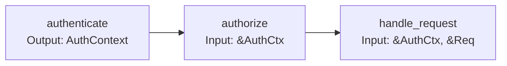

# Ranvier Philosophy: Opinionated Core, Flexible Edges

**Version:** 0.33.0
**Updated:** 2026-03-15
**Applies to:** ranvier-core, ranvier-runtime
**Category:** Architecture

---

## Introduction

Ranvier is a Rust framework for building event-driven systems with a clear design philosophy: **Opinionated Core, Flexible Edges**. This document explains what that means, why it matters, and how to apply this philosophy when building with Ranvier.

**TL;DR**: Ranvier enforces a specific paradigm (Transition/Outcome/Bus/Schematic) for its internal architecture, but gives you complete freedom to integrate with other Rust ecosystem tools (Tower, actix, Axum, etc.) at the boundaries.

---

## 1. Core Paradigm

> *"The core is what makes Ranvier, Ranvier."*

Ranvier's identity is built on four foundational concepts:

### 1.1. Transition

**Definition**: A `Transition` is a pure, composable function that transforms one state into another, potentially failing with a typed error. It's the fundamental unit of computation in Ranvier.

**Key characteristics**:
- **Pure**: Given the same input, always produces the same output (modulo async I/O)
- **Typed**: Input, output, and error types are explicit
- **Composable**: Transitions can be chained with `.pipe()`, `.fanout()`, `.parallel()`
- **Testable**: Easy to unit test in isolation

**Why it matters**:
- **Type safety**: Compiler catches invalid state transitions at build time
- **Composition**: Build complex workflows by chaining simple transitions
- **Visibility**: Each transition appears as a node in the Schematic graph
- **Testing**: Mock inputs/outputs without touching infrastructure

**Example**:
```rust
use ranvier::prelude::*;

#[transition]
async fn validate_input(req: Request) -> Outcome<ValidRequest, ValidationError> {
    if req.body.is_empty() {
        return Outcome::err(ValidationError::EmptyBody);
    }
    Outcome::ok(ValidRequest::from(req))
}

#[transition]
async fn process(input: ValidRequest) -> Outcome<Response, ProcessError> {
    // Business logic here
    let result = compute(&input).await?;
    Outcome::ok(Response::new(result))
}

// Compose:
let pipeline = Axon::simple::<AppError>()
    .pipe(validate_input, process)
    .build();
```

### 1.2. Outcome

**Definition**: An `Outcome` is Ranvier's result type that represents success (`ok`) or failure (`err`), with explicit error types. It's similar to `Result<T, E>` but integrates with the Transition system.

**Key characteristics**:
- **Explicit errors**: Each transition declares its error type
- **Bus integration**: Successful outcomes can store values in the Bus
- **Schematic metadata**: Outcomes carry metadata for visualization
- **Ergonomic**: `?` operator works, plus helper methods like `.map()`, `.and_then()`

**Why it matters**:
- **Error transparency**: See all possible failures in the type signature
- **Graceful degradation**: Handle errors at the right level (transition, pipeline, global)
- **Debugging**: Outcome metadata helps trace failures through the schematic

**Example**:
```rust
// Transition returns Outcome
#[transition]
async fn fetch_user(id: UserId) -> Outcome<User, DatabaseError> {
    match db.get_user(id).await {
        Ok(user) => Outcome::ok(user),
        Err(e) => Outcome::err(DatabaseError::from(e)),
    }
}

// Outcome values automatically stored in Bus if marked
#[transition]
async fn enrich_user(user: User) -> Outcome<EnrichedUser, EnrichmentError> {
    // 'user' came from Bus (injected automatically)
    let profile = fetch_profile(&user).await?;
    Outcome::ok(EnrichedUser { user, profile })
}
```

### 1.3. Bus

**Definition**: The `Bus` is a type-safe, in-memory store for sharing state between transitions within a single execution context. Think of it as "dependency injection for data".

**Key characteristics**:
- **Type-indexed**: Store and retrieve values by their type (like `TypeMap`)
- **Automatic injection**: Transitions can request values from the Bus via parameters
- **Scoped**: Each execution has its own Bus instance (no global state)
- **Immutable references**: Transitions receive `&T` from the Bus (no ownership transfer)

**Why it matters**:
- **Explicit dependencies**: Transition signatures show what data they need
- **No magic globals**: All state is explicit and scoped to the execution
- **Testability**: Inject mock values into the Bus for testing
- **Context propagation**: Pass authentication, tenant ID, etc. through the pipeline

**Example**:
```rust
#[transition]
async fn authenticate(req: Request) -> Outcome<AuthContext, AuthError> {
    let token = extract_token(&req)?;
    let auth = validate(token).await?;
    // AuthContext automatically stored in Bus for downstream transitions
    Outcome::ok(auth)
}

#[transition]
async fn authorize(auth: &AuthContext) -> Outcome<(), AuthError> {
    // 'auth' automatically injected from Bus (by type)
    if !auth.has_role("admin") {
        return Outcome::err(AuthError::Unauthorized);
    }
    Outcome::ok(())
}

#[transition]
async fn handle_request(auth: &AuthContext, req: &Request) -> Outcome<Response, AppError> {
    // Both 'auth' and 'req' injected from Bus
    Ok(Response::new(format!("Hello, {}", auth.user_id)))
}
```

### 1.4. Schematic

**Definition**: A `Schematic` is a directed acyclic graph (DAG) representation of your transition pipeline. It's both a runtime execution model and a visual artifact (JSON) that tools like VSCode can render.

**Key characteristics**:
- **Nodes**: Each transition is a node
- **Edges**: Data flow between transitions
- **Metadata**: Types, error paths, execution stats
- **Serializable**: Export to `schematic.json` for visualization

**Why it matters**:
- **Visibility**: See your entire data flow at a glance (in VSCode Circuit view)
- **Documentation**: The schematic IS the documentation (always up-to-date)
- **Debugging**: Trace errors through the graph, see which node failed
- **Optimization**: Identify bottlenecks, parallelize where possible

**Example**:
```rust
// Build a schematic
let schematic = Axon::simple::<AppError>()
    .pipe(authenticate, authorize, handle_request)
    .build();

// Execute
let outcome = schematic.execute(request).await;

// Export to JSON (for VSCode visualization)
let json = schematic.to_json();
std::fs::write("schematic.json", json)?;
```

**Visualization** (in VSCode):


---

## 2. Why Opinionated Core?

> *"Constraints enable clarity."*

Ranvier's core is deliberately opinionated for three strategic reasons. While "opinionated" might sound limiting, it's actually what makes Ranvier productive and distinct.

### 2.1. Identity: What Makes Ranvier, Ranvier?

**Problem**: Rust has many web frameworks (Actix, Axum, Rocket, Warp, Tide...). Why another one?

**Answer**: Ranvier is not "another web framework" — it's a **schematic-first, event-driven framework**. The Transition/Outcome/Bus/Schematic paradigm is our unique value proposition.

If we made Transition optional or Bus configurable, we'd lose our identity and become "yet another HTTP wrapper around Hyper."

**Concrete benefits**:
- **Unique niche**: Ranvier excels at complex, stateful workflows (multi-step auth, saga patterns, event sourcing)
- **Visual debugging**: No other Rust framework gives you VSCode-integrated circuit views
- **Type-driven composition**: The compiler guides you toward correct architectures

**Analogy**:
- **Actix** = "actor model for web apps"
- **Axum** = "ergonomic routing with Tower middleware"
- **Ranvier** = "schematic-first, visualizable data flows"

Each has a clear identity. Ranvier's opinionated core IS that identity.

### 2.2. Learning Curve: One Right Way, Not Ten Ways

**Problem**: Flexible frameworks offer choice, but choice creates cognitive load. "Should I use middleware X or Y? Pattern A or B?"

**Ranvier's approach**:
- **One blessed path**: Use Transition for business logic. Always.
- **Clear migration**: If you need ecosystem tools, there's a documented integration path
- **Reduced decision fatigue**: New users don't waste time evaluating alternatives

**Example**:
```rust
// ❌ Confusion in a flexible framework:
// "Do I use middleware? Extractors? Guards? Service layers?"

// ✅ Clarity in Ranvier:
// "Write a Transition. Chain with .pipe(). Done."
#[transition]
async fn my_logic(input: Input) -> Outcome<Output, Error> {
    // Business logic here
}
```

**Learning ROI**:
- **Week 1**: Learn Transition/Outcome/Bus → productive immediately
- **Week 2**: Learn Schematic visualization → debugging superpowers
- **Week 3**: Learn ecosystem integration (if needed) → best of both worlds

Compare to frameworks where Week 1-3 is just "which crate should I use for X?"

### 2.3. Consistency: Codebases That Look Alike

**Problem**: In flexible frameworks, every team/project invents their own patterns. Onboarding new developers is slow because every codebase is a snowflake.

**Ranvier's approach**: All Ranvier codebases follow the same structure:
```
src/
├── transitions/   # Business logic (Transition functions)
├── outcomes/      # Domain types
├── schematics/    # Pipeline composition
└── main.rs        # Axon setup
```

**Benefits**:
- **Faster onboarding**: Developers moving between Ranvier projects recognize the patterns instantly
- **Easier code review**: Reviewers know what "good Ranvier code" looks like
- **Tool support**: Editors, linters, generators can assume a consistent structure

**Analogy**: Rails' "convention over configuration" made Ruby teams highly productive. Ranvier applies the same principle to Rust event-driven systems.

**Real-world impact**:
- Team A's authentication flow looks like Team B's payment flow → transfer knowledge easily
- Ranvier examples from GitHub work in your project with minimal changes
- VSCode extensions can provide smart completions (they know the structure)

---

## 3. Why Flexible Edges?

> *"Integrate, don't isolate."*

While the core is opinionated, Ranvier embraces the Rust ecosystem at its boundaries. "Flexible Edges" means you can use any Rust library, framework, or pattern at the integration points.

### 3.1. Ecosystem Integration: Standing on Giants' Shoulders

**Problem**: If Ranvier enforced its paradigm everywhere, you'd need "Ranvier-specific" versions of every tool:
- Ranvier-HTTP, Ranvier-DB, Ranvier-Cache, Ranvier-Metrics, Ranvier-Tracing...
- This is unsustainable and isolates Ranvier from the broader Rust community.

**Solution**: Ranvier's core (Transition/Bus/Schematic) is protocol-agnostic. At the edges, use whatever you want:
- **HTTP**: Hyper 1.0, Tower, actix-web, Axum, warp
- **Database**: sqlx, diesel, sea-orm, mongodb
- **Caching**: redis, memcached, in-memory
- **Metrics**: Prometheus, OpenTelemetry, statsd
- **Tracing**: tracing, log, slog

**Example**: Using Tower middleware with Ranvier
```rust
use tower::ServiceBuilder;
use tower_http::cors::CorsLayer;
use ranvier::prelude::*;

// Tower handles infrastructure (CORS, tracing, timeouts)
let app = ServiceBuilder::new()
    .layer(CorsLayer::permissive())
    .layer(TraceLayer::new_for_http())
    .layer(TimeoutLayer::new(Duration::from_secs(30)))
    .service(ranvier_handler);

// Ranvier handles business logic (inside ranvier_handler)
#[transition]
async fn business_logic(req: Request) -> Outcome<Response, AppError> {
    // Pure business logic, no infrastructure concerns
}
```

**Benefits**:
- **Reuse existing knowledge**: If your team knows Tower, use Tower layers
- **Leverage battle-tested code**: Tower's CORS/Trace/Timeout are production-hardened
- **Stay current**: When tower-http releases v0.7, you can upgrade immediately (no "waiting for Ranvier support")

### 3.2. Gradual Migration: From X to Ranvier, Step by Step

**Problem**: "All or nothing" frameworks are risky. Rewriting a production app from scratch is expensive and dangerous.

**Solution**: Ranvier allows incremental adoption:

**Migration Path 1: Tower → Ranvier**
1. **Week 1**: Keep existing Tower layers, replace one handler with Ranvier Transition
2. **Week 2**: Replace more handlers, keep Tower infrastructure
3. **Week 3**: Start converting Tower middleware to Transitions (if desired)
4. **Result**: Production-proven incremental migration, rollback if needed

**Migration Path 2: Ranvier + existing tools**
- Start new feature in Ranvier (for visualization benefits)
- Keep legacy code as-is (interoperate via HTTP/gRPC)
- No "big rewrite", just gradual improvement

**Example**: Hybrid approach
```rust
// Legacy Tower auth layer (keep it, it works)
let auth_layer = RequireAuthorizationLayer::new(...);

// New Ranvier business logic (get visualization)
#[transition]
async fn new_feature(auth: &AuthContext) -> Outcome<Response, Error> {
    // Modern code with Schematic visualization
}

// Combine
let app = ServiceBuilder::new()
    .layer(auth_layer)  // Tower (legacy)
    .service(ranvier_pipeline);  // Ranvier (new)
```

**Real-world scenario**:
- **Company X** has 50 Tower-based services
- Adopts Ranvier for new "payment orchestration" service (needs complex workflows)
- Payment service uses Ranvier Transitions, but still calls existing Tower services
- **Result**: Best of both worlds, no disruption

### 3.3. User Autonomy: You Know Your Constraints Best

**Problem**: Framework authors can't predict every use case. Rigid frameworks force workarounds when your needs diverge from the "happy path."

**Ranvier's philosophy**: We're opinionated about **what** (use Transitions for business logic), not **how** (you choose HTTP server, DB, deployment).

**Autonomy examples**:

**Example 1: HTTP Server**
- Ranvier doesn't dictate Hyper vs actix-web vs Axum
- Use `ranvier-http` (Hyper-based) for simplicity
- Or integrate Ranvier into your existing Axum app:
  ```rust
  // Axum route that calls Ranvier
  async fn axum_handler(State(schematic): State<Schematic>) -> Response {
      schematic.execute(req).await.into()
  }
  ```

**Example 2: Database**
- Ranvier doesn't force sqlx vs diesel
- Write a Transition that uses *your* DB library:
  ```rust
  #[transition]
  async fn fetch_user(pool: &PgPool, id: UserId) -> Outcome<User, DbError> {
      // Use sqlx, diesel, sea-orm, whatever you want
      let user = sqlx::query_as("SELECT ...").fetch_one(pool).await?;
      Outcome::ok(user)
  }
  ```

**Example 3: Deployment**
- Ranvier doesn't mandate Docker/K8s/serverless
- Deploy as a binary, container, Lambda — Ranvier is just Rust code

**Trade-off transparency**:
Ranvier tells you:
- ✅ "Use Transition for business logic" (opinionated)
- ✅ "Integrate Tower if you need CORS" (flexible)
- ❌ "You must use our HTTP crate" (too opinionated)
- ❌ "Figure out everything yourself" (too flexible)

**Sweet spot**: Opinionated where it matters (paradigm), flexible where it doesn't (infrastructure).

---

## 4. Boundary: Where Core Ends, Edges Begin

> *"Know where to be rigid, know where to be flexible."*

Understanding the boundary between "core" (opinionated) and "edges" (flexible) is crucial for effective Ranvier usage. Here's a clear map:

### 4.1. Core Territory (Opinionated — Must Use Ranvier Paradigm)

These must use Transition/Outcome/Bus/Schematic:

| Domain | Rule | Why |
|--------|------|-----|
| **Business logic** | Use `#[transition]` | Visualization, composition, testability |
| **Data flow** | Return `Outcome<T, E>` | Type-safe error propagation |
| **State sharing** | Store in `Bus` | Explicit dependencies |
| **Pipeline composition** | Use `Axon::pipe()`, `.parallel()` | Schematic graph generation |
| **Domain errors** | Define custom error enums | Clear failure modes |

**Examples of Core patterns**:

```rust
// ✅ Core: Business logic as Transition
#[transition]
async fn validate_order(order: Order) -> Outcome<ValidOrder, ValidationError> {
    if order.items.is_empty() {
        return Outcome::err(ValidationError::EmptyOrder);
    }
    Outcome::ok(ValidOrder::from(order))
}

// ✅ Core: State in Bus
#[transition]
async fn calculate_tax(order: &ValidOrder, tax_rate: &TaxRate) -> Outcome<Tax, TaxError> {
    // tax_rate injected from Bus
}

// ✅ Core: Composition with Axon
let pipeline = Axon::simple()
    .pipe(validate_order, calculate_tax, apply_discount)
    .build();
```

**Anti-patterns** (using external patterns in core):
```rust
// ❌ Don't: Regular function instead of Transition
async fn my_logic(input: Input) -> Result<Output, Error> {
    // Won't appear in Schematic, can't compose with .pipe()
}

// ❌ Don't: Global state instead of Bus
static AUTH: Mutex<Option<AuthContext>> = Mutex::new(None);
// Implicit dependencies, not testable, not visualized
```

### 4.2. Edge Territory (Flexible — Use Any Rust Tool)

These can use any Rust library or pattern:

| Domain | Flexibility | Examples |
|--------|-------------|----------|
| **HTTP server** | Any | Hyper, Tower, Axum, actix-web, warp |
| **Database** | Any | sqlx, diesel, sea-orm, mongodb, postgres |
| **Caching** | Any | redis, memcached, moka, dashmap |
| **Serialization** | Any | serde_json, bincode, msgpack, protobuf |
| **Metrics** | Any | prometheus, opentelemetry, statsd |
| **Tracing** | Any | tracing, log, slog, env_logger |
| **Async runtime** | Any | tokio, async-std, smol (Ranvier is runtime-agnostic) |

**Examples of Edge integrations**:

```rust
// ✅ Edge: Tower middleware
use tower::ServiceBuilder;
use tower_http::cors::CorsLayer;

let app = ServiceBuilder::new()
    .layer(CorsLayer::permissive())
    .service(ranvier_handler);

// ✅ Edge: sqlx for database
#[transition]
async fn fetch_user(pool: &PgPool, id: UserId) -> Outcome<User, DbError> {
    let user = sqlx::query_as("SELECT * FROM users WHERE id = $1")
        .bind(id)
        .fetch_one(pool)
        .await?;
    Outcome::ok(user)
}

// ✅ Edge: redis for caching
#[transition]
async fn get_cached(cache: &RedisPool, key: &str) -> Outcome<String, CacheError> {
    let value = cache.get(key).await?;
    Outcome::ok(value)
}
```

### 4.3. Gray Zones (Context-Dependent)

Some domains can go either way. Choose based on your needs:

#### Gray Zone 1: Middleware / Guards

**Question**: Should I use Tower middleware or Ranvier Transition for authentication?

**Answer**: Both are valid. Choose based on trade-offs:

| Approach | Pro | Con | When to use |
|----------|-----|-----|-------------|
| **Transition-based** | Schematic visualization, testable, composable | Ranvier-specific | New projects, need visualization |
| **Tower middleware** | Ecosystem reuse, team knowledge | Not in Schematic | Existing Tower app, team knows Tower |

```rust
// Option A: Transition (Ranvier way, visualized)
#[transition]
async fn authenticate(req: Request) -> Outcome<AuthContext, AuthError> {
    // Appears in Schematic graph
}

// Option B: Tower (ecosystem way, not visualized)
let app = ServiceBuilder::new()
    .layer(RequireAuthorizationLayer::new(...))
    .service(ranvier_handler);
```

#### Gray Zone 2: Error Handling

**Question**: Should I use `Outcome<T, E>` or `Result<T, E>`?

**Answer**:
- **Inside Transitions**: Always `Outcome` (required by #[transition])
- **Outside Transitions** (helpers, utils): `Result` is fine, convert at boundary

```rust
// Helper function (outside Transition) — Result OK
fn parse_config(path: &Path) -> Result<Config, ConfigError> {
    // ...
}

// Transition (core) — Outcome required
#[transition]
async fn load_config(path: &Path) -> Outcome<Config, AppError> {
    let config = parse_config(path)
        .map_err(AppError::from)?;  // Convert Result → Outcome
    Outcome::ok(config)
}
```

#### Gray Zone 3: State Management

**Question**: Should I use Bus or framework-specific state (e.g., Axum `State`)?

**Answer**:
- **Request-scoped data** (auth, tenant): Bus (visualized in Schematic)
- **Global shared resources** (DB pool, config): Framework state or Arc

```rust
// Request-scoped: Bus (changes per request)
#[transition]
async fn handler(auth: &AuthContext, tenant: &TenantId) -> Outcome<...> {
    // auth, tenant from Bus
}

// Global shared: Axum State (same for all requests)
async fn axum_route(
    State(pool): State<PgPool>,
    State(schematic): State<Schematic>,
) -> Response {
    // pool, schematic shared across requests
}
```

**Rule of thumb**:
- **Core** (business logic, data flow, composition) → Ranvier paradigm
- **Edges** (infrastructure, I/O, deployment) → Any Rust tool
- **Gray zones** → Choose based on: visualization needs, team knowledge, migration path

---

## 5. Decision Framework

> *"How to choose your approach."*

When you face a choice between "Ranvier way" and "ecosystem way", use this framework:

### 5.1. Questions to Ask

Ask these questions in order. The first "Yes" determines your approach:

| # | Question | If Yes | Why |
|---|----------|--------|-----|
| **1** | **Is this core business logic?**<br/>(validation, calculation, orchestration) | Ranvier way | Visualization, composition, testability |
| **2** | **Do I need to see it in the Schematic graph?**<br/>(debug complex flows, document for team) | Ranvier way | Only Transitions appear in Circuit view |
| **3** | **Is this pure infrastructure?**<br/>(CORS, TLS, rate limiting, circuit breaking) | Ecosystem way | Reuse battle-tested libraries (Tower) |
| **4** | **Am I migrating from an existing codebase?**<br/>(Tower app, actix service) | Hybrid | Start with ecosystem, gradually adopt Ranvier |
| **5** | **Does my team already know tool X?**<br/>(Tower, Axum, diesel) | Ecosystem way → Ranvier | Use existing knowledge, wrap in Transition later |
| **6** | **Is this a one-off utility?**<br/>(config parser, CLI arg handler) | `Result<T,E>` | Don't force Transition on non-pipeline code |

### 5.2. Example Scenarios

#### Scenario 1: Authentication

**Context**: You need to verify JWT tokens before handling requests.

**Decision tree**:
1. **Is this core business logic?** → Partially (authorization is, JWT parsing isn't)
2. **Do I need visualization?** → If complex (multi-factor, role-based), Yes
3. **Existing Tower app?** → If yes, start with Tower

**Recommendation**:

| Situation | Approach | Why |
|-----------|----------|-----|
| **New project** | Transition-based | Visualize auth flow, test easily |
| **Existing Tower app** | Tower middleware | Don't break working code |
| **Complex RBAC** | Transition-based | Need to see `authenticate → check_subscription → authorize` in Schematic |
| **Simple API key** | Tower middleware | Overkill to use Transition for 1 line |

**Code**:
```rust
// Simple case: Tower middleware (not visualized)
let app = ServiceBuilder::new()
    .layer(ValidateRequestHeaderLayer::bearer("secret"))
    .service(ranvier_handler);

// Complex case: Transition (visualized)
#[transition]
async fn authenticate(req: Request) -> Outcome<AuthContext, AuthError> { /*...*/ }

#[transition]
async fn check_subscription(auth: &AuthContext) -> Outcome<(), AuthError> { /*...*/ }

#[transition]
async fn authorize(auth: &AuthContext, required_role: &str) -> Outcome<(), AuthError> { /*...*/ }

let pipeline = Axon::simple()
    .pipe(authenticate, check_subscription, authorize, handle_request)
    .build();
```

#### Scenario 2: CORS

**Context**: Need to add CORS headers to HTTP responses.

**Decision tree**:
1. **Is this core business logic?** → No (pure infrastructure)
2. **Do I need visualization?** → No (static config)
3. **Existing solution?** → Yes (`tower-http::cors`)

**Recommendation**: ✅ **Use Tower's `CorsLayer`** (ecosystem way)

**Code**:
```rust
use tower::ServiceBuilder;
use tower_http::cors::{CorsLayer, Any};

let app = ServiceBuilder::new()
    .layer(
        CorsLayer::new()
            .allow_origin(Any)
            .allow_methods(Any)
    )
    .service(ranvier_handler);
```

**Why not Transition?**
- CORS is static configuration (not dynamic logic)
- Tower's `CorsLayer` is battle-tested
- No benefit from visualization (no branching logic)

#### Scenario 3: Database Access

**Context**: Fetch/insert data from PostgreSQL.

**Decision tree**:
1. **Is this core business logic?** → Partially (queries are infrastructure, *what* to fetch is logic)
2. **Do I need visualization?** → Depends on complexity

**Recommendation**: **Transition wrapping your DB library of choice**

| DB Library | Use in Transition | Why |
|------------|-------------------|-----|
| **sqlx** | ✅ | Async-native, type-checked SQL |
| **diesel** | ✅ | Type-safe query builder |
| **sea-orm** | ✅ | Active Record pattern |

**Code**:
```rust
// Use any DB library inside a Transition
#[transition]
async fn fetch_user(pool: &PgPool, id: UserId) -> Outcome<User, DbError> {
    let user = sqlx::query_as!(User, "SELECT * FROM users WHERE id = $1", id)
        .fetch_one(pool)
        .await
        .map_err(DbError::from)?;
    Outcome::ok(user)
}

#[transition]
async fn update_balance(user: &User, amount: i64) -> Outcome<(), DbError> {
    // Appears in Schematic: fetch_user → update_balance
    sqlx::query!("UPDATE users SET balance = balance + $1 WHERE id = $2", amount, user.id)
        .execute(pool)
        .await?;
    Outcome::ok(())
}
```

**Why Transition?**
- Visualize query sequence in Schematic
- Test with mock DB pool
- Compose with other Transitions (e.g., `fetch → validate → update → audit`)

#### Scenario 4: Metrics/Tracing

**Context**: Add Prometheus metrics or OpenTelemetry traces.

**Decision tree**:
1. **Is this core business logic?** → No (observability is infrastructure)
2. **Existing solution?** → Yes (Tower's `TraceLayer`, prometheus crate)

**Recommendation**: ✅ **Use Tower/ecosystem tools**

**Code**:
```rust
use tower_http::trace::TraceLayer;

let app = ServiceBuilder::new()
    .layer(TraceLayer::new_for_http())  // Automatic tracing
    .service(ranvier_handler);

// Or manual instrumentation inside Transition:
#[transition]
async fn process(input: Input) -> Outcome<Output, Error> {
    tracing::info!("Processing input: {:?}", input);
    // ...
}
```

#### Scenario 5: WebSocket Handling

**Context**: Need bidirectional real-time communication.

**Decision tree**:
1. **Is this core business logic?** → Partially (message handling is)
2. **Do I need visualization?** → If complex state machine, Yes

**Recommendation**: **Hybrid** — Tower for WebSocket upgrade, Transition for message processing

**Code**:
```rust
// Tower upgrades HTTP → WebSocket
let ws_layer = WebSocketUpgrade::new(|socket| async {
    // Inside WebSocket handler:
    while let Some(msg) = socket.recv().await {
        // Ranvier Transition processes each message
        let outcome = message_pipeline.execute(msg).await;
        socket.send(outcome.into()).await;
    }
});
```

### 5.3. Decision Flowchart

```
START
  │
  ├─ Core business logic? ───Yes──> Ranvier way (Transition)
  │
  ├─ Need visualization? ────Yes──> Ranvier way
  │
  ├─ Pure infrastructure? ───Yes──> Ecosystem way (Tower/library)
  │
  ├─ Migrating existing? ────Yes──> Hybrid (Tower + Ranvier)
  │
  └─ Default ────────────────────> Ranvier way (when in doubt)
```

### 5.4. Summary Table

| Domain | Ranvier Way | Ecosystem Way | Hybrid |
|--------|-------------|---------------|--------|
| **Business logic** | ✅ Always | ❌ Never | - |
| **Complex auth** | ✅ Recommended | ⚠️ Possible | ✅ Common |
| **CORS** | ❌ Overkill | ✅ Use Tower | - |
| **Database** | ✅ Wrap in Transition | ⚠️ Direct use OK | ✅ Common |
| **Metrics** | ⚠️ Manual | ✅ Use Tower | - |
| **Middleware** | ✅ For business rules | ✅ For infrastructure | ✅ Common |
| **WebSocket** | ✅ Message processing | ✅ Upgrade logic | ✅ Recommended |

**Key**: ✅ Recommended | ⚠️ Acceptable | ❌ Anti-pattern

---

## 6. Decision Tree

> *"What should I use for my project?"*

This decision tree helps you choose the right approach for your specific situation. Follow the flowchart, then see detailed recommendations below.

### 6.1. Quick Decision Flowchart

```
                    START: "Should I use Ranvier, Tower, or both?"
                                      │
                                      ▼
        ┌─────────────────────────────────────────────────────┐
        │  Q1: Are you starting a NEW project from scratch?   │
        └─────────────────────────────────────────────────────┘
                 │                                │
                YES                              NO
                 │                                │
                 ▼                                ▼
        ┌───────────────────┐         ┌─────────────────────────┐
        │ Ranvier Way       │         │ Q2: Existing codebase?  │
        │ (Transition)      │         └─────────────────────────┘
        │                   │                     │
        │ ✅ Recommended:   │         ┌───────────┴──────────────┐
        │ - Full visibility │        YES                        NO
        │ - Clean slate     │         │                          │
        │ - Best practices  │         ▼                          ▼
        └───────────────────┘  ┌──────────────┐      ┌──────────────────┐
                               │ Tower app?   │      │ Other framework? │
                               └──────────────┘      └──────────────────┘
                                      │                       │
                              ┌───────┴────────┐             │
                             YES               NO             │
                              │                 │             │
                              ▼                 ▼             ▼
                     ┌────────────────┐  ┌─────────────┐  ┌────────────┐
                     │ Hybrid         │  │ actix/Axum? │  │ Standalone │
                     │ (Tower +       │  └─────────────┘  │ service?   │
                     │  Ranvier)      │         │         └────────────┘
                     │                │    ┌────┴─────┐        │
                     │ ✅ Start:      │   YES        NO         │
                     │ - Keep Tower   │    │          │         ▼
                     │   layers       │    ▼          ▼    ┌──────────┐
                     │ - Add Ranvier  │ ┌─────┐  ┌──────┐ │ Ranvier  │
                     │   for new      │ │Embed│  │Custom│ │ with     │
                     │   features     │ │in   │  │      │ │ ecosystem│
                     └────────────────┘ │actix│  │wrap  │ │ tools    │
                                        └─────┘  └──────┘ └──────────┘
```

### 6.2. Detailed Decision Paths

#### Path 1: New Project ✅ (Recommended)

**Situation**: Starting from scratch, no existing codebase.

**Recommendation**: **Pure Ranvier (Transition-based)**

**Why**:
- ✅ No legacy constraints
- ✅ Full Schematic visualization from day 1
- ✅ Team learns one paradigm (not mixing patterns)
- ✅ Clean, testable architecture

**How to start**:
```bash
# Create new project
cargo new my-app
cd my-app

# Add Ranvier
cargo add ranvier --features http

# Write first transition
cat > src/main.rs <<'EOF'
use ranvier::prelude::*;

#[transition]
async fn hello() -> Outcome<String, Never> {
    Outcome::ok("Hello from Ranvier!".into())
}

#[tokio::main]
async fn main() {
    let app = Axon::simple().pipe(hello).build();
    // Setup HTTP server...
}
EOF
```

**Next steps**:
1. Read Ranvier Getting Started guide
2. Follow examples in `examples/auth-transition`
3. Build schematic incrementally
4. Visualize in VSCode Circuit view

---

#### Path 2: Existing Tower App 🔧

**Situation**: Production Tower app, want to add Ranvier features.

**Recommendation**: **Hybrid (Tower infrastructure + Ranvier business logic)**

**Why**:
- ✅ Don't break working code
- ✅ Gradual adoption (low risk)
- ✅ Reuse existing Tower layers (CORS, auth, tracing)
- ✅ Get Ranvier benefits for new features only

**Migration strategy**:
```rust
// Week 1: Keep ALL Tower layers, add Ranvier for ONE new endpoint
let existing_tower_app = ServiceBuilder::new()
    .layer(CorsLayer::permissive())
    .layer(AuthLayer::new(...))
    .layer(TraceLayer::new())
    .service(tower_router);  // Keep existing

// Add Ranvier handler for new feature
#[transition]
async fn new_feature() -> Outcome<Response, Error> {
    // New code uses Ranvier
}

// Week 2-4: Convert more endpoints to Ranvier
// Week 5+: Optionally convert Tower auth to Ranvier Transition
```

**Trade-off**:
- ⚠️ Mixed paradigms (Tower + Ranvier) — acceptable during migration
- ⚠️ Tower layers not in Schematic — only Ranvier parts visualized
- ✅ Zero disruption to production

---

#### Path 3: actix-web or Axum Integration 🔌

**Situation**: Using actix-web or Axum, want Ranvier's visualization/composition.

**Recommendation**: **Embed Ranvier transitions inside framework handlers**

**actix-web example**:
```rust
use actix_web::{web, App, HttpServer, HttpResponse};
use ranvier::prelude::*;

// Ranvier transition
#[transition]
async fn process(input: String) -> Outcome<String, Error> {
    // Business logic
    Outcome::ok(input.to_uppercase())
}

// actix handler calls Ranvier
async fn actix_handler(body: String) -> HttpResponse {
    let schematic = Axon::simple().pipe(process).build();
    match schematic.execute(body).await {
        Ok(result) => HttpResponse::Ok().body(result),
        Err(e) => HttpResponse::InternalServerError().body(e.to_string()),
    }
}

#[actix_web::main]
async fn main() {
    HttpServer::new(|| {
        App::new().route("/", web::post().to(actix_handler))
    }).bind("127.0.0.1:8080")?.run().await
}
```

**Axum example**:
```rust
use axum::{Router, routing::post, extract::State};

// Ranvier schematic as shared state
#[tokio::main]
async fn main() {
    let schematic = Axon::simple().pipe(process).build();

    let app = Router::new()
        .route("/", post(axum_handler))
        .with_state(schematic);

    axum::Server::bind(&"0.0.0.0:3000".parse().unwrap())
        .serve(app.into_make_service())
        .await
}

async fn axum_handler(State(schematic): State<Schematic>, body: String) -> String {
    schematic.execute(body).await.unwrap_or_else(|e| e.to_string())
}
```

**Benefits**:
- ✅ Keep actix/Axum routing, middleware, extractors
- ✅ Use Ranvier for complex business logic (visualized)
- ✅ Best of both worlds

---

#### Path 4: Complex Business Logic Only 🧠

**Situation**: You have complex workflows (multi-step processing, state machines, saga patterns).

**Recommendation**: **Ranvier for business logic, any HTTP framework for serving**

**Example use cases**:
- **Order processing**: validate → check inventory → calculate tax → apply discount → charge → ship
- **Document pipeline**: upload → OCR → extract data → validate → enrich → store
- **Multi-factor auth**: check password → verify SMS → check device → create session

**Why Ranvier shines**:
- ✅ Visualize entire flow (7+ steps clear in Schematic)
- ✅ Test each step independently
- ✅ Parallel execution (`.parallel()`)
- ✅ Easy to add/remove steps

**Pattern**:
```rust
// Complex business logic in Ranvier
let order_pipeline = Axon::simple()
    .pipe(validate_order, check_inventory)
    .parallel(calculate_tax, apply_discount, check_fraud)
    .pipe(charge_payment, create_shipment, send_confirmation)
    .build();

// Serve with any HTTP framework
// - Hyper: ranvier-http
// - Axum: State(order_pipeline)
// - actix: web::Data<Schematic>
// - Tower: ServiceBuilder::service(ranvier_adapter)
```

---

### 6.3. Special Cases

#### Case A: "I just need CORS/auth, not complex workflows"

**Answer**: Use **Tower/actix/Axum directly** (don't use Ranvier)

Ranvier adds value when you have:
- Multi-step workflows
- Need for visualization
- Complex state management

For simple CORS/auth, ecosystem tools are simpler:
```rust
// Just use Tower
let app = ServiceBuilder::new()
    .layer(CorsLayer::permissive())
    .layer(AuthLayer::bearer("secret"))
    .service(simple_handler);
```

#### Case B: "Team doesn't know Ranvier OR Tower"

**Answer**: **Start with Ranvier** (learn one paradigm, not two)

Tower has a steeper learning curve (Service trait, Layer trait, middleware ordering).
Ranvier's Transition macro is simpler:
```rust
// Ranvier: Simple
#[transition]
async fn my_logic(input: Input) -> Outcome<Output, Error> { ... }

// Tower: Complex
impl<S> Service<Request> for MyService<S> {
    type Response = Response;
    type Error = Error;
    type Future = Pin<Box<dyn Future<Output = Result<Self::Response, Self::Error>>>>;
    fn call(&mut self, req: Request) -> Self::Future { ... }
}
```

#### Case C: "Microservices architecture"

**Answer**: **Ranvier for orchestration service, any framework for leaf services**

```
┌─────────────────────────────┐
│ API Gateway (Tower/Axum)    │  ← Simple routing
└──────────┬──────────────────┘
           │
           ▼
┌─────────────────────────────┐
│ Orchestrator (Ranvier)      │  ← Complex workflows, visualized
│  - Multi-service calls      │
│  - Saga pattern             │
│  - Compensation logic       │
└──────┬─────┬────────┬───────┘
       │     │        │
       ▼     ▼        ▼
   ┌────┐ ┌────┐  ┌────┐
   │User│ │Pay │  │Ship│       ← Simple CRUD (any framework)
   └────┘ └────┘  └────┘
```

---

### 6.4. Summary: "When should I use Ranvier?"

| Your Situation | Use Ranvier? | Approach |
|----------------|--------------|----------|
| **New project, complex workflows** | ✅ YES | Pure Ranvier (Transition) |
| **New project, simple CRUD** | ⚠️ Maybe | Ranvier if you want visualization; otherwise simpler frameworks OK |
| **Existing Tower app** | ✅ YES | Hybrid (keep Tower, add Ranvier for new features) |
| **Existing actix/Axum app** | ✅ YES | Embed Ranvier in handlers |
| **Microservice orchestration** | ✅ YES | Ranvier for orchestrator |
| **Leaf CRUD services** | ❌ NO | Use simpler frameworks |
| **Just need CORS/basic auth** | ❌ NO | Tower/actix/Axum middleware is simpler |
| **Multi-step state machines** | ✅ YES | Ranvier's sweet spot |
| **Team new to Rust ecosystem** | ✅ YES | Learn Ranvier (simpler than Tower) |
| **Team expert in Tower** | ⚠️ Hybrid | Start with Tower + Ranvier hybrid |

**Default recommendation**: If in doubt and you have **any** multi-step logic, **use Ranvier**. The visualization alone justifies the investment.

---

## Code Examples

### Example 1: Pure Ranvier (Transition-based Authentication)

**Scenario**: Multi-step authentication with JWT validation, role checking, and audit logging.

**Why Ranvier way**: Complex flow benefits from Schematic visualization and testability.

```rust
use ranvier::prelude::*;
use jsonwebtoken::{decode, DecodingKey, Validation};
use serde::{Deserialize, Serialize};

// Domain types
#[derive(Debug, Clone, Serialize, Deserialize)]
struct AuthContext {
    user_id: String,
    roles: Vec<String>,
}

#[derive(Debug, thiserror::Error)]
enum AuthError {
    #[error("Missing authorization header")]
    MissingHeader,
    #[error("Invalid token: {0}")]
    InvalidToken(String),
    #[error("Unauthorized: requires role {0}")]
    Unauthorized(String),
}

// Transition 1: Extract and validate JWT
#[transition]
async fn authenticate(req: Request) -> Outcome<AuthContext, AuthError> {
    // Extract Authorization header
    let header = req.headers()
        .get("Authorization")
        .ok_or(AuthError::MissingHeader)?;

    let token = header
        .to_str()
        .ok()?
        .strip_prefix("Bearer ")
        .ok_or(AuthError::InvalidToken("Invalid format".into()))?;

    // Validate JWT
    let secret = std::env::var("JWT_SECRET").expect("JWT_SECRET not set");
    let key = DecodingKey::from_secret(secret.as_bytes());
    let claims = decode::<AuthContext>(token, &key, &Validation::default())
        .map_err(|e| AuthError::InvalidToken(e.to_string()))?
        .claims;

    // AuthContext automatically stored in Bus
    Outcome::ok(claims)
}

// Transition 2: Check role-based authorization
#[transition]
async fn authorize(auth: &AuthContext, required_role: &str) -> Outcome<(), AuthError> {
    // AuthContext automatically injected from Bus
    if !auth.roles.contains(&required_role.to_string()) {
        return Outcome::err(AuthError::Unauthorized(required_role.into()));
    }
    Outcome::ok(())
}

// Transition 3: Audit log (optional)
#[transition]
async fn audit_log(auth: &AuthContext, req: &Request) -> Outcome<(), Never> {
    tracing::info!(
        user_id = %auth.user_id,
        path = %req.uri().path(),
        "Authenticated request"
    );
    Outcome::ok(())
}

// Transition 4: Business logic
#[transition]
async fn protected_handler(auth: &AuthContext) -> Outcome<Response, AppError> {
    let body = format!("Hello, {}! Roles: {:?}", auth.user_id, auth.roles);
    Ok(Response::new(body.into()))
}

// Compose pipeline
fn main() {
    let admin_pipeline = Axon::simple::<AppError>()
        .pipe(authenticate, |auth| authorize(auth, "admin"), audit_log, protected_handler)
        .build();

    // Visualize in VSCode:
    // authenticate → authorize → audit_log → protected_handler
    //                  ↓ (if unauthorized)
    //                401 Unauthorized
}
```

**Benefits**:
- ✅ **Visualization**: See auth flow in Schematic (4 nodes)
- ✅ **Testing**: Mock AuthContext in Bus, test each Transition independently
- ✅ **Composition**: Easily add new steps (e.g., `check_subscription` between `authorize` and `handler`)
- ✅ **Type safety**: Compiler ensures auth→handler pipeline is valid

### Example 2: Tower Integration (Ecosystem Way)

**Scenario**: Simple API key validation using Tower's existing ecosystem.

**Why Tower way**: Reuse battle-tested `tower-http::auth`, team already knows Tower.

```rust
use tower::ServiceBuilder;
use tower_http::auth::RequireAuthorizationLayer;
use hyper::{Request, Response, Body};

// Tower authorization validator
async fn validate_api_key(request: &Request<Body>) -> Result<(), &'static str> {
    let header = request.headers()
        .get("X-API-Key")
        .ok_or("Missing API key")?;

    let key = header.to_str().map_err(|_| "Invalid API key format")?;

    if key != "secret-key-123" {
        return Err("Invalid API key");
    }

    Ok(())
}

// Ranvier handler (business logic)
#[transition]
async fn business_logic(req: Request) -> Outcome<Response, AppError> {
    // Tower already validated API key
    Ok(Response::new("Authenticated!".into()))
}

fn main() {
    // Tower handles auth (not in Schematic)
    let app = ServiceBuilder::new()
        .layer(RequireAuthorizationLayer::custom(validate_api_key))
        .service(ranvier_handler);

    // Ranvier handles business logic (in Schematic)
}
```

**Trade-offs**:
- ✅ **Ecosystem reuse**: Tower's `RequireAuthorizationLayer` is production-tested
- ✅ **Team knowledge**: If team knows Tower, no learning curve
- ❌ **No visualization**: Tower layer is opaque in Schematic
- ❌ **Limited composition**: Can't insert steps between "validate" and "handle" easily

### Example 3: Hybrid Approach (Best of Both Worlds)

**Scenario**: Use Tower for infrastructure (CORS, rate limiting), Ranvier for business logic (authentication, authorization).

**Why hybrid**: Leverage Tower's infrastructure layers + Ranvier's visualization for business logic.

```rust
use tower::ServiceBuilder;
use tower_http::{cors::CorsLayer, limit::RateLimitLayer};
use std::time::Duration;

// Tower handles infrastructure
let app = ServiceBuilder::new()
    .layer(CorsLayer::permissive())  // Infrastructure: CORS
    .layer(RateLimitLayer::new(100, Duration::from_secs(60)))  // Infrastructure: Rate limit
    .service(ranvier_handler);

// Ranvier handles business logic (visualized)
let ranvier_handler = Axon::simple::<AppError>()
    .pipe(authenticate, authorize, audit_log, protected_handler)
    .build();
```

**Visualization in VSCode**:
```
Tower Layers (hidden):
  ├─ CORS
  └─ Rate Limit
      ↓
Ranvier Pipeline (visualized):
  authenticate → authorize → audit_log → protected_handler
```

**Best for**:
- Existing Tower apps adding Ranvier incrementally
- Teams that want infrastructure from Tower, business logic visualization from Ranvier
- Production apps that need battle-tested CORS/rate limiting + custom auth flows

### Example 4: Real-World Pattern (E-commerce Order Processing)

**Full Ranvier way** for complex business logic:

```rust
#[transition]
async fn authenticate(req: Request) -> Outcome<AuthContext, AuthError> { /*...*/ }

#[transition]
async fn parse_order(req: &Request) -> Outcome<Order, ValidationError> { /*...*/ }

#[transition]
async fn check_inventory(order: &Order) -> Outcome<(), InventoryError> { /*...*/ }

#[transition]
async fn calculate_tax(order: &Order, auth: &AuthContext) -> Outcome<Tax, TaxError> {
    // Tax rate depends on user's location (from auth)
    /*...*/
}

#[transition]
async fn apply_discount(order: &Order, auth: &AuthContext) -> Outcome<Discount, ()> {
    // VIP users get 10% off
    if auth.roles.contains(&"vip".into()) {
        Outcome::ok(Discount::percent(10))
    } else {
        Outcome::ok(Discount::none())
    }
}

#[transition]
async fn charge_payment(order: &Order, tax: &Tax, discount: &Discount) -> Outcome<PaymentId, PaymentError> { /*...*/ }

#[transition]
async fn create_shipment(order: &Order, payment: &PaymentId) -> Outcome<ShipmentId, ShipmentError> { /*...*/ }

let pipeline = Axon::simple::<AppError>()
    .pipe(authenticate, parse_order)
    .parallel(check_inventory, calculate_tax, apply_discount)  // Run in parallel
    .pipe(charge_payment, create_shipment)
    .build();
```

**Schematic visualization**:
```
authenticate → parse_order → ┬─ check_inventory ─┐
                              ├─ calculate_tax ────┤→ charge_payment → create_shipment
                              └─ apply_discount ───┘
```

**Why Ranvier shines here**:
- **Complex flow**: 7 steps with parallel execution
- **Visualization**: See entire order flow in VSCode Circuit view
- **Testing**: Mock each step independently (inventory check, tax calculation, payment)
- **Debugging**: If shipment fails, trace back through Schematic to see which step passed what data

---

## Summary

**Opinionated Core**:
- Transition/Outcome/Bus/Schematic are non-negotiable
- This is Ranvier's identity and value proposition

**Flexible Edges**:
- Integrate with Tower, actix, Axum, or any Rust library
- Gradual migration and ecosystem compatibility

**When in doubt**: Start with the Ranvier way (Transition-based). If you hit a specific limitation or have existing infrastructure, integrate ecosystem tools.

---

## Related Documents

- [DESIGN_PRINCIPLES.md](DESIGN_PRINCIPLES.md) — Architecture decision records (ADR)
- [examples/auth-transition/](examples/auth-transition/) — Ranvier way authentication
- [examples/auth-tower-integration/](examples/auth-tower-integration/) — Tower integration
- [guides/auth-comparison.md](guides/auth-comparison.md) — Transition vs Tower comparison
- [Web Integration Guides](https://ranvier.rs/guides/integration) — Tower/actix/Axum guides

---

## Feedback

This philosophy document evolves with the framework. If you have feedback or questions:
- Open an issue: https://github.com/ranvier-rs/ranvier/issues
- Join discussions: https://github.com/ranvier-rs/ranvier/discussions

---

*This document is part of Ranvier v0.33.0. Last updated: 2026-03-15.*
