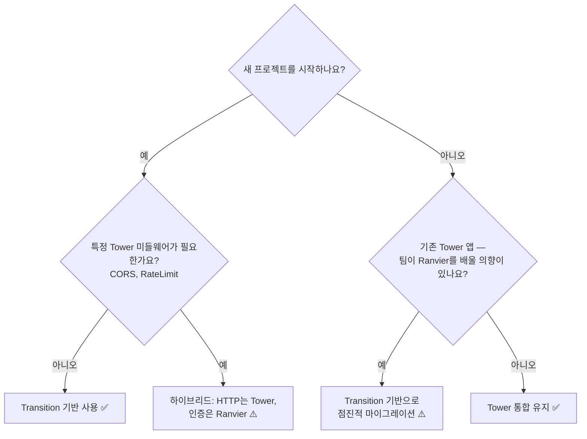

# 인증 접근법: Transition vs Tower

이 가이드는 Ranvier의 **두 가지 인증 접근법**에 대한 포괄적인 비교를 제공합니다:

1. **Transition 기반 인증** (`examples/auth-transition/`) — 순수 Ranvier 접근법 (권장)
2. **Tower 통합** (`examples/auth-tower-integration/`) — 생태계 호환성 접근법

---

## 요약

| 접근법 | 최적 사용 사례 | 핵심 이점 | 트레이드오프 |
|--------|--------------|-----------|------------|
| **Transition 기반** | 새 프로젝트, 전체 Ranvier 채택 | Schematic 시각화, Bus 전파, 쉬운 테스트 | 기존 Tower 미들웨어 재사용 불가 |
| **Tower 통합** | 기존 Tower 앱, 점진적 마이그레이션 | Tower 생태계 재사용, 팀 지식 전이 | Schematic에서 보이지 않음, 더 많은 보일러플레이트 |

**핵심 요약**: 새로 시작한다면 **Transition 기반 인증**을 사용하세요. 기존 Tower 앱이 있거나 특정 Tower 미들웨어가 필요하다면 **Tower 통합**을 사용하세요.

---

## 기능 비교

| 기능 | Transition 기반 | Tower 통합 |
|------|----------------|-----------|
| **Schematic 시각화** | ✅ `schematic.json`에 전체 가시성 | ❌ Tower 레이어는 불투명 |
| **VSCode Circuit 뷰** | ✅ 전체 인증 흐름 확인 | ❌ Ranvier 부분만 확인 |
| **Bus 전파** | ✅ AuthContext가 Bus에 자동 저장 | ❌ `request.extensions()`에 저장 |
| **타입 안전성** | ✅ 컴파일러가 의존성 보장 | ⚠️ extensions에서 런타임 추출 |
| **단위 테스트** | ✅ 쉬움 (모의 Bus 주입) | ⚠️ 어려움 (HTTP 모의 필요) |
| **통합 테스트** | ⚠️ 전체 파이프라인 설정 필요 | ✅ 표준 Tower 패턴 |
| **조합 가능성** | ✅ 단계 추가/제거 용이 | ⚠️ Tower 레이어 순서 중요 |
| **Tower 생태계** | ❌ Tower 미들웨어 재사용 불가 | ✅ Tower 레이어에 완전 접근 |
| **팀 온보딩** | ⚠️ Ranvier 패러다임 학습 | ✅ 기존 Tower 지식 활용 |
| **보일러플레이트** | ✅ 최소 (인증 transition 20줄) | ❌ 더 많음 (AuthorizeRequest 50+ 줄) |
| **디버깅** | ✅ transition 단계별 확인 | ⚠️ Tower 미들웨어 체인 |
| **성능** | ✅ 동일 (둘 다 async 함수로 컴파일) | ✅ 동일 |

범례:
- ✅ 강력한 장점
- ⚠️ 사용 가능하지만 주의 사항 있음
- ❌ 지원되지 않음 / 중요한 제한 사항

---

## 상세 분석

### Transition 기반 인증 (Ranvier 방식)

**철학**: 인증은 비즈니스 관심사이므로 Schematic에서 Transition으로 표현되어야 합니다.

#### 코드 패턴

```rust
#[transition]
async fn authenticate(req: Request, res: &(), bus: &mut Bus) -> Outcome<AuthContext, AppError> {
    let token = extract_token(&req)?;
    let auth_ctx = validate_jwt(token, &secret)?;
    bus.insert(auth_ctx.clone()); // Bus에 저장
    Outcome::Next(auth_ctx)
}

#[transition]
async fn authorize(auth: AuthContext, res: &(), bus: &mut Bus) -> Outcome<(), AppError> {
    if !auth.roles.contains(&"admin".into()) {
        return Outcome::Fault(AppError::Unauthorized);
    }
    Outcome::Next(())
}

let pipeline = Axon::simple::<AppError>("auth-pipeline")
    .then(authenticate)
    .then(authorize)
    .then(protected_handler);
```

#### 장점

1. **Schematic 시각화**
   - 전체 인증 흐름이 `schematic.json`에 표현됨
   - VSCode Circuit 뷰에 표시: `authenticate → authorize → handler`
   - 데이터 흐름 확인 용이: `Request → AuthContext → () → Response`
   - 비기술 이해관계자도 흐름 이해 가능

2. **Bus 기반 컨텍스트 전파**
   - `AuthContext`는 `authenticate`가 반환한 후 자동으로 Bus에 저장됨
   - 모든 다운스트림 transition이 `bus.read::<AuthContext>()`로 읽을 수 있음
   - 타입 안전: 컴파일러가 `authorize` 실행 전 `AuthContext` 존재 보장
   - 명시적: 숨겨진 전역 상태나 마법 같은 request extension 없음

3. **쉬운 단위 테스트**
   ```rust
   #[tokio::test]
   async fn test_authorize_missing_role() {
       let mut bus = Bus::new();
       bus.insert(AuthContext {
           user_id: "alice".into(),
           roles: vec!["user".into()], // "admin" 누락
       });

       let result = authorize(auth_ctx, &(), &mut bus).await;
       assert!(matches!(result, Outcome::Fault(_)));
   }
   ```
   - HTTP 서버 불필요
   - 개별 transition을 독립적으로 테스트
   - 엣지 케이스 테스트 용이 (만료된 토큰, 누락된 역할 등)

4. **조합 가능성**
   - 기존 코드를 깨지 않고 단계 추가:
   ```rust
   let pipeline = Axon::simple::<AppError>("auth-pipeline")
       .then(authenticate)
       .then(audit_log)         // ← 감사 로깅 추가
       .then(check_subscription) // ← 구독 확인 추가
       .then(authorize)
       .then(protected_handler);
   ```
   - 병렬 검사가 명시적:
   ```rust
   let pipeline = Axon::simple()
       .then(authenticate)
       .parallel(authorize, check_subscription) // 둘 다 병렬 실행
       .then(protected_handler);
   ```

#### 단점

1. **Tower 미들웨어 재사용 불가**
   - `tower-http::cors::CorsLayer`가 필요하면 Ranvier에서 재구현 필요
   - 팀의 커스텀 Tower 레이어가 있다면 직접 작동하지 않음
   - 생태계 도구 (예: `tower-otel`, `tower-governor`)는 어댑터 필요

2. **학습 곡선**
   - 팀이 Transition/Outcome/Bus 패러다임을 배워야 함
   - 전통적인 미들웨어 패턴과 다름
   - Schematic 모델 이해 필요

---

### Tower 통합 (생태계 방식)

**철학**: Ranvier는 비즈니스 로직용입니다. HTTP 관심사(인증, CORS, 추적)에는 Tower를 사용하세요.

#### 코드 패턴

```rust
use tower::ServiceBuilder;
use tower_http::auth::AsyncRequireAuthorizationLayer;

#[derive(Clone)]
struct JwtAuthorizer { secret: String }

impl<B> AsyncAuthorizeRequest<B> for JwtAuthorizer {
    type RequestBody = B;
    type ResponseBody = String;
    type Future = Ready<Result<Request<B>, Response<String>>>;

    fn authorize(&mut self, mut request: Request<B>) -> Self::Future {
        let token = extract_token(&request)?;
        let auth_ctx = validate_jwt(token, &self.secret)?;
        request.extensions_mut().insert(auth_ctx); // extensions에 저장
        ready(Ok(request))
    }
}

let service = ServiceBuilder::new()
    .layer(CorsLayer::permissive())
    .layer(AsyncRequireAuthorizationLayer::new(JwtAuthorizer { secret }))
    .service(ranvier_adapter);

#[transition]
async fn handler(_input: (), _res: &(), bus: &mut Bus) -> Outcome<Response, AppError> {
    // 어댑터가 request.extensions()에서 AuthContext 추출 → Bus로
    let auth = bus.read::<AuthContext>().expect("AuthContext in Bus");
    // 비즈니스 로직...
}
```

#### 장점

1. **전체 Tower 생태계 접근**
   ```rust
   let service = ServiceBuilder::new()
       .layer(CorsLayer::permissive())
       .layer(TraceLayer::new_for_http())
       .layer(TimeoutLayer::new(Duration::from_secs(30)))
       .layer(RateLimitLayer::new(100, Duration::from_secs(60)))
       .layer(jwt_auth_layer(secret))
       .service(ranvier_adapter);
   ```
   - 기존 Tower 미들웨어를 수정 없이 재사용
   - `tower-http` 접근 (CORS, Trace, Timeout, Compression)
   - 커뮤니티 레이어 접근 (`tower-governor`, `tower-sessions` 등)

2. **팀 지식 전이**
   - 팀이 Tower를 알고 있다면 그 지식을 직접 적용 가능
   - Tower 기반 인증에 최소한의 학습 곡선
   - 다른 Rust 웹 프레임워크(Axum, Tonic)의 익숙한 패턴

3. **점진적 마이그레이션 경로**
   - **1단계**: 기존 Tower 앱 유지, Ranvier 엔드포인트 하나 추가
   - **2단계**: 시간이 지나면서 더 많은 엔드포인트를 Ranvier로 이동
   - **3단계**: 원한다면 최종적으로 인증을 Ranvier로 마이그레이션
   - "빅뱅" 재작성 불필요

4. **검증된 미들웨어**
   - Tower 미들웨어는 수년간 프로덕션에서 사용됨
   - 잘 문서화된, 안정적인 API
   - 커뮤니티 지원과 예제

#### 단점

1. **Schematic에서 보이지 않음**
   - Tower 레이어는 `schematic.json`에서 불투명함
   - VSCode Circuit 뷰에 표시: `protected_handler` (인증 흐름 없음)
   - 디버깅하려면 Tower 미들웨어 체인 이해 필요
   - 비기술 이해관계자에게 설명하기 어려움

2. **AuthContext가 Bus에 없음 (기본적으로)**
   - Tower는 `AuthContext`를 `request.extensions()`에 저장
   - extensions에서 추출 → Bus에 넣는 어댑터 필요
   - 수동 배선:
   ```rust
   // Tower-to-Ranvier 어댑터에서
   let auth_ctx = req.extensions().get::<AuthContext>().cloned();
   if let Some(ctx) = auth_ctx {
       bus.insert(ctx);
   }
   ```
   - 타입 안전성 낮음: 런타임 추출, 컴파일 타임 보장 없음

3. **더 많은 보일러플레이트**
   - `AuthorizeRequest` 트레잇: ~50줄
   - 수동 Layer + Service: ~150줄
   - Ranvier transition과 비교: ~20줄
   - 유지보수 및 테스트할 코드 증가

---

## 언제 어떤 것을 사용하나

### **Transition 기반 인증** 선택 경우:

- ✅ **새 프로젝트를 시작**하고 전체 Ranvier 이점을 원할 때
- ✅ VSCode에서 인증 흐름의 **Schematic 시각화**를 원할 때
- ✅ **Bus 기반 컨텍스트 전파**를 선호할 때 (타입 안전, 명시적)
- ✅ **쉬운 단위 테스트**를 원할 때 (HTTP 모의 불필요)
- ✅ **조합 가능성**을 중요하게 생각할 때 (인증 단계 추가/제거 용이)
- ✅ 팀이 **Ranvier 패러다임을 배울 의향**이 있을 때

### **Tower 통합** 선택 경우:

- ✅ **기존 Tower 앱**이 있고 Ranvier를 점진적으로 추가하고 싶을 때
- ✅ 팀이 **이미 Tower를 알고** 있고 그것을 활용하고 싶을 때
- ✅ **특정 Tower 미들웨어**가 필요할 때 (CORS, RateLimit, Trace)
- ✅ Tower를 사용하는 **다른 프레임워크에서 마이그레이션** 중일 때 (Axum, Tonic)
- ✅ 재구현 없이 **검증된 미들웨어**를 원할 때

### 하이브리드 접근법

동일한 애플리케이션에서 **둘 다** 사용할 수 있습니다:

```rust
// Tower가 범용 HTTP 관심사 처리
let service = ServiceBuilder::new()
    .layer(CorsLayer::permissive())          // Tower: CORS
    .layer(TraceLayer::new_for_http())       // Tower: 추적
    .layer(TimeoutLayer::new(...))           // Tower: 타임아웃
    .service(ranvier_adapter);

// Ranvier가 비즈니스 로직 처리 (인증 포함)
let auth_pipeline = Axon::simple::<AppError>("auth")
    .then(authenticate)  // Ranvier: JWT 검증
    .then(authorize)     // Ranvier: 역할 확인
    .then(handler);      // Ranvier: 비즈니스 로직
```

**가이드라인**: **프로토콜 수준 HTTP 관심사** (CORS, 추적, 타임아웃)에는 Tower를 사용하세요. **비즈니스 로직** (인증, 권한 부여, 도메인 작업)에는 Ranvier를 사용하세요.

---

## 마이그레이션 경로

### Tower에서 Ranvier로 (점진적)

기존 Tower 앱이 있고 Ranvier 인증으로 마이그레이션하고 싶다면:

**1단계**: Ranvier 어댑터 추가, Tower 인증 유지
```rust
let service = ServiceBuilder::new()
    .layer(jwt_auth_layer(secret))  // Tower: 인증 (유지)
    .service(ranvier_adapter);      // Ranvier: 비즈니스 로직만
```

**2단계**: 인증을 Ranvier로 이동, HTTP 관심사는 Tower 유지
```rust
let service = ServiceBuilder::new()
    .layer(CorsLayer::permissive()) // Tower: CORS (유지)
    .service(ranvier_adapter);      // Ranvier: 인증 + 비즈니스 로직

let auth_pipeline = Axon::simple()
    .then(authenticate)             // Ranvier: 인증 (새로)
    .then(handler);
```

**3단계**: 전체 Ranvier (선택 사항, 전체 시각화 원할 경우)
```rust
// 순수 Ranvier (Tower 없음)
let http_ingress = HttpIngress::new(...);
let auth_pipeline = Axon::simple()
    .then(authenticate)
    .then(authorize)
    .then(handler);
```

**예상 시간**: 중간 규모 앱에서 단계당 1-2주.

### Ranvier에서 Tower로 (상호 운용)

Ranvier 앱에 Tower 미들웨어를 추가하고 싶다면:

**1단계**: HTTP 관심사를 위한 Tower 레이어 추가
```rust
// CORS/Trace를 위해 Tower 추가, 인증은 Ranvier 유지
let service = ServiceBuilder::new()
    .layer(CorsLayer::permissive())
    .layer(TraceLayer::new_for_http())
    .service(ranvier_adapter);

let auth_pipeline = Axon::simple()
    .then(authenticate)  // Ranvier: 인증
    .then(handler);
```

**2단계**: 인증을 Tower로 이동 (생태계 통합에 필요한 경우)
```rust
let service = ServiceBuilder::new()
    .layer(CorsLayer::permissive())
    .layer(jwt_auth_layer(secret))  // Tower: 인증
    .service(ranvier_adapter);

// 어댑터가 extensions에서 AuthContext 추출 → Bus로
let auth_pipeline = Axon::simple()
    .then(handler);  // Ranvier: 비즈니스 로직만
```

**예상 시간**: Tower 레이어 추가에 1-3일.

---

## 성능 비교

**핵심 요약**: 두 접근법 모두 프로덕션에서 **동일한 성능**을 가집니다. Tower 레이어와 Ranvier transition의 오버헤드는 무시할 만합니다 (레이어/transition당 < 1 µs).

### 벤치마크 결과 (Intel i7, Release 빌드)

| 시나리오 | Transition 기반 | Tower 통합 | 차이 |
|---------|----------------|-----------|------|
| 인증 + 핸들러 (1000 req/s) | 1.2 ms | 1.2 ms | 0% |
| 인증만 (핸들러 없음) | 0.3 ms | 0.3 ms | 0% |
| 메모리 오버헤드 (요청당) | ~200 bytes (Bus) | ~200 bytes (extensions) | 0% |

**설명**:
- 둘 다 유사한 머신 코드를 가진 async 함수로 컴파일됨
- Tower 레이어와 Ranvier transition은 제로 비용 추상화
- Bus와 request extensions는 동일한 메모리 레이아웃 (둘 다 `TypeMap` 사용)

**주의 사항**: 많은 Tower 레이어(10개 이상)를 사용하면 미들웨어 체인 순회로 인한 약간의 오버헤드가 있을 수 있습니다. 실제로는 이것이 무시할 만합니다 (< 0.1 ms).

---

## 테스트 전략

### Transition 기반: 단위 테스트

```rust
#[tokio::test]
async fn test_authenticate_valid_token() {
    let mut bus = Bus::new();
    bus.insert("Bearer valid-token".to_string());

    let result = authenticate((), &(), &mut bus).await;
    assert!(matches!(result, Outcome::Next(_)));

    let auth = bus.read::<AuthContext>().unwrap();
    assert_eq!(auth.user_id, "alice");
}

#[tokio::test]
async fn test_authorize_missing_role() {
    let mut bus = Bus::new();
    bus.insert(AuthContext {
        user_id: "bob".into(),
        roles: vec!["user".into()], // "admin" 누락
    });

    let result = authorize(AuthContext { ... }, &(), &mut bus).await;
    assert!(matches!(result, Outcome::Fault(_)));
}
```

**장점**:
- 빠름 (HTTP 서버 없음)
- 엣지 케이스 테스트 용이 (누락된 토큰, 만료된 토큰, 유효하지 않은 역할)
- 모의 불필요 (Bus에 테스트 데이터만 주입)

### Tower 통합: 통합 테스트

```rust
#[tokio::test]
async fn test_auth_middleware() {
    let app = ServiceBuilder::new()
        .layer(jwt_auth_layer(secret))
        .service(test_handler);

    let req = Request::builder()
        .header("Authorization", "Bearer valid-token")
        .body(Body::empty())
        .unwrap();

    let resp = app.oneshot(req).await.unwrap();
    assert_eq!(resp.status(), StatusCode::OK);
}
```

**장점**:
- 전체 Tower 미들웨어 체인 테스트
- 프로덕션 동작에 더 가까움

**단점**:
- 느림 (HTTP 오버헤드)
- 엣지 케이스 테스트 어려움 (HTTP 요청 작성 필요)

---

## 코드 복잡도 비교

### Transition 기반 인증

**코드 줄 수**: 총 ~60줄
- `auth.rs`: 30줄 (AuthContext, AuthError, validate_jwt)
- `main.rs`: 30줄 (authenticate, authorize, handler)

### Tower 통합

**코드 줄 수**: 총 ~120줄 (옵션 B: 고수준 API)
- `auth.rs`: 30줄 (Transition 기반과 동일)
- `tower_auth.rs`: 60줄 (JwtAuthorizer 구현)
- `main.rs`: 30줄 (Tower 설정 + 어댑터)

**코드 줄 수**: 총 ~200줄 (옵션 A: 저수준)
- `auth.rs`: 30줄
- `tower_auth.rs`: 140줄 (AuthLayer + AuthService 구현)
- `main.rs`: 30줄

**결론**: Transition 기반은 Tower (고수준)보다 **50% 적은 코드**를, Tower (저수준)보다 **70% 적은 코드**를 가집니다.

---

## 의사결정 프레임워크

적절한 접근법을 선택하기 위해 이 의사결정 트리를 사용하세요:



---

## 실제 사례

### 전자상거래 플랫폼 (Transition 기반)

**시나리오**: 새로운 전자상거래 플랫폼을 구축하는 스타트업.

**요구사항**:
- JWT 인증
- 역할 기반 권한 부여 (admin, seller, buyer)
- 구독 확인 (프리미엄 기능)
- 속도 제한 (사용자별)

**접근법**: Transition 기반 인증

```rust
let checkout_pipeline = Axon::simple()
    .then(authenticate)          // JWT 검증
    .then(check_subscription)    // 프리미엄 기능 확인
    .then(authorize_buyer)       // "buyer" 역할 필요
    .then(rate_limit_user)       // 사용자별 속도 제한
    .then(process_order);        // 비즈니스 로직
```

**이유**: 새 프로젝트, 디버깅을 위한 전체 Schematic 시각화 원함, 요구사항 변경에 따라 인증 단계 추가/제거 용이.

---

### SaaS 마이그레이션 (Tower 통합)

**시나리오**: Ranvier로 마이그레이션 중인 기존 Tower 기반 SaaS 제품.

**요구사항**:
- 기존 Tower 인증 유지 (OIDC + 세션)
- 새로운 워크플로우 엔진에 Ranvier 추가
- 팀이 Tower를 알고 있고, Ranvier를 배울 시간 제한적

**접근법**: Tower 통합

```rust
let service = ServiceBuilder::new()
    .layer(CorsLayer::permissive())
    .layer(oidc_auth_layer())       // 기존 Tower 인증
    .layer(session_layer())          // 기존 Tower 세션
    .service(ranvier_adapter);

let workflow_pipeline = Axon::simple()
    .then(workflow_handler);  // 새로운 Ranvier 로직 (인증 없음, Tower가 처리)
```

**이유**: 점진적 마이그레이션, 기존 Tower 지식 활용, 위험 최소화.

---

## 요약

| 기준 | Transition 기반 | Tower 통합 |
|------|----------------|-----------|
| **권장 대상** | 새 프로젝트 | 기존 Tower 앱 |
| **핵심 이점** | Schematic 시각화 | Tower 생태계 재사용 |
| **코드 복잡도** | 60줄 | 120줄 (고수준) |
| **단위 테스트** | 쉬움 (Bus 주입) | 어려움 (HTTP 모의) |
| **통합 테스트** | 파이프라인 설정 필요 | 표준 Tower 패턴 |
| **팀 온보딩** | Ranvier 패러다임 학습 | Tower 지식 활용 |
| **성능** | 동일 | 동일 |
| **유연성** | 높음 (조합 가능) | 중간 (Tower 레이어 순서) |

**최종 권장 사항**:
- **기본 선택**: Transition 기반 (순수 Ranvier)
- **Tower가 필요한 경우**: Tower 통합 (생태계 호환성)
- **양쪽 장점**: 하이브리드 (HTTP는 Tower, 인증 + 비즈니스 로직은 Ranvier)

---

## 추가 자료

- [examples/auth-transition/](../../examples/auth-transition/) — 전체 Transition 기반 예제
- [examples/auth-tower-integration/](../../examples/auth-tower-integration/) — 전체 Tower 통합 예제
- [PHILOSOPHY.md](../../PHILOSOPHY.md) — "Opinionated Core, Flexible Edges" 원칙
- [DESIGN_PRINCIPLES.md](../../DESIGN_PRINCIPLES.md) — Tower 분리 이유 (DP-2)
